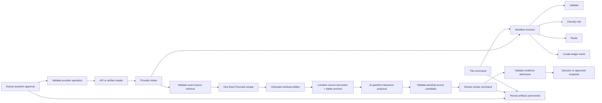

# Function-Based Script Architecture

Status: Active implementation constraints for the current script-first slices.

## Purpose

Keep each script small enough to understand locally while preserving boundaries that can support later providers, batching, persistence, and user interfaces when those needs are demonstrated.

The product is a general evidence-grounded memo tool over the approved Seerist API surface plus OSINT search, discovery, and retrieval. Cyber threat intelligence is the first working profile, not a core-module boundary. Domain modules should therefore express research intent, evidence, context, relevance, claims, and memo output without assuming that every question is cyber-specific or requires Vestas relevance.

All organization-approved Seerist endpoints are target acquisition surfaces, but only observed and tested endpoints belong to the executable baseline. Each new endpoint or OSINT mechanism terminates at a narrow adapter and the existing provider-neutral role and source contracts whenever those contracts remain sufficient.

Scalability comes from explicit data and replaceable functions, not from framework abstractions added in advance.

## Dependency direction



Dependencies point inward:

1. Commands may depend on workflows and side-effect functions.
2. Workflows may depend on domain modules and shared primitives.
3. Domain modules may depend on shared primitives, but never on commands or workflows.
4. Provider-specific intake may produce provider-neutral facts; provider-neutral decisions must not import provider clients or raw response schemas.
5. Probes are developer discovery tools and must not become production dependencies.

## Folder ownership

| Location | Owns | Must not own |
| --- | --- | --- |
| `app/src/commands/` | Arguments, process exit, concise console output, concrete side-effect wiring | Classification or routing policy |
| `app/src/probes/` | Provider contract discovery and raw-response inspection | Production workflow behavior |
| `app/src/workflow/` | One use case composed from plain functions | Provider HTTP details or console formatting |
| `app/src/modules/` | Validation, provider intake, classification, routing, and ledger-data creation | Process exit, environment lookup, or direct console output |
| `app/src/core/` | `Result<T, E>` and types proven to be shared across modules | Provider payload mirrors or speculative abstractions |

Create a folder only when its first implementation file is needed.

## Function rules

1. Prefer plain functions with explicit input and output types.
2. Use `Result<T, E>` and literal error types for expected validation, classification, and routing failures.
3. Keep raw provider values at the intake boundary. Pass only validated observed facts into provider-neutral decisions.
4. Model alternatives with discriminated unions rather than optional-field bags when behavior differs by role.
5. Model output may populate a typed proposal, but only deterministic validation may persist it and only in proposed or pending state. Narrative text, model output, and provider scores cannot advance approval state.
6. Keep source values and provider taxonomies open unless repeated live responses prove a closed set.
7. Add a shared abstraction only after the same need appears in at least three places.

## Side-effect boundary

The command layer owns:

- Environment and argument reads.
- API and filesystem access.
- Current time and generated identifiers.
- Console output and process exit.
- Persistence of raw artifacts and append-only events.

Domain functions receive these values as inputs and return data describing what should be recorded. They do not hide writes or wall-clock reads.

The one-item intake workflow supplies ledger timestamps explicitly. The ledger helper does not read the wall clock.

## Current one-item flow

```text
approved research question + bound provider operation
  -> validate approval, chronology, question ID, run ID, and endpoint allowlist
  -> perform one read-only Seerist request or one bounded multi-query discovery plan
  -> preserve response and question lineage
  -> for discovery, deduplicate and deterministically rank candidates
  -> saved raw artifact + selected item
  -> validate observed envelope
  -> extract provider-neutral facts
  -> classify as evidence candidate | collection lead | context
  -> route native captured content to canonicalization, leads to retrieval, and context to context-only handling
  -> for one approved collection lead, retrieve one exact source URL and stop
  -> losslessly canonicalize captured content into stable content-addressed segments
  -> assess one canonical source against the approved question with a bounded AI call
  -> validate assessment schema, exact anchors, model provenance, and source/question lineage
  -> re-intake relevant or partially relevant material as a pending proposal
  -> route the new candidate to pending human review
  -> create ledger event data
  -> command persists output
```

Provider credentials and HTTP remain inaccessible until the research-intent gate succeeds. No intake route may produce evidence status `approved`; evidence approval requires a later explicit human action and auditable transition.

Bounded discovery is sequential, capped by explicit query, page, call, and result limits, and preserves each raw page. It is not a general batch runner and does not automatically advance any candidate into intake.

One-source retrieval validates the persisted intake result before reading `FIRECRAWL_API_KEY`. It sends one fixed, Markdown-only `/v2/scrape` request, preserves the bounded raw response, records publisher and access-provider provenance separately, and stops with `approvalStatus: "not_requested"`. Retrieved text is untrusted data.

The accepted next connection first creates the provider-neutral source document defined in `../02-Contracts/source-document-and-anchors.md`, then runs a bounded AI assessment against the exact approved research question. Deterministic code must validate the typed assessment, exact anchors, model provenance, and artifact lineage before it can persist a pending candidate. The AI cannot approve evidence or start `Find`; the existing human evidence gate remains required for both.

Canonicalization changes addressing, not evidence content or quality. Every admitted source still passes through independent `Find`, blind `Sweep`, `Judge`, and `Write` before cross-source synthesis. Scaling uses independent source state streams, reusable adapters, checksum deduplication, and bounded scheduling rather than skipped stages.

Initial native Seerist evidence candidates cannot enter evidence admission. They route through the provider-neutral canonical document and relevance assessment first. The current `reintake:source` command still accepts a human-authored relevance string. That input shape is transitional and must not be used for live re-intake after the 2026-08-31 architecture decision. The bounded assessment artifact is now implemented through `prepare:question-relevance` and `record:question-relevance`; conversion of a validated positive assessment into the existing pending candidate shape remains the next connection.

Until an approved Azure AI Foundry deployment exists, GitHub Copilot in VS Code is a manual PoC transport between those two commands. The adapter records that its underlying model is not exposed. It has no filesystem or transition authority through the application, and the deterministic validators and artifact contract remain the future Foundry boundary.

## Current evidence-admission flow

```text
persisted intake result + explicit reviewer decision
  -> reconstruct and validate eligible evidence candidate
  -> validate reviewer, timestamp, reason, and item identity
  -> hash referenced raw provider artifact
  -> record approved or rejected decision
  -> create non-overwritable approved snapshot only for approval
  -> append human-attributed event
```

The Markdown decision receipt is a derived read-only view. It has no controls and no state authority.

## Testing layers

1. Domain tests call pure functions with synthetic structural fixtures.
2. Workflow tests compose real domain functions with controlled timestamps and in-memory side-effect substitutes.
3. Command smoke tests cover argument handling and exit behavior only when command complexity warrants them.
4. Live provider probes validate external behavior separately and do not replace deterministic tests.

Do not commit provider narrative content as a fixture unless retention and test-data use are explicitly permitted.

## Scale only on evidence

| Demonstrated need | Smallest next abstraction |
| --- | --- |
| A second provider repeats the same operation | A narrow provider operation type or function contract |
| Three commands repeat side-effect wiring | A shared command helper |
| Batch execution is required | A sequential runner over the existing one-item workflow |
| Durable resume is required | A persistence boundary around existing events and artifacts |
| Concurrent workers are required | A queue contract preserving stable item IDs and ordering |

Do not add provider base classes, plugin registries, dependency-injection containers, event buses, generic repositories, or orchestration frameworks before one of these triggers exists.

## Review checklist

Before expanding a script, verify:

1. Can its command entry point be understood without reading domain policy?
2. Can each domain decision be tested without API, filesystem, clock, environment, or console access?
3. Does provider-specific code stop at validated observed facts?
4. Is every state transition explicit and auditable?
5. Is the proposed abstraction justified by repeated working code?