# Threat Intelligence Memo Workflow

Version: 2.2
Status: Canonical target architecture. Implementation remains slice-driven.
Last updated: 2026-08-31
Visual: `../01-Architecture/memo-workflow-board.svg`
Source assurance detail: `../01-Architecture/source-assurance-goal-loops.svg`
Seerist capability visual: `../01-Architecture/seerist-api-capability-board.svg`
Observed provider facts: `seerist-probe-findings.md`
Implementation constraints: `../01-Architecture/script-architecture.md`

## Purpose

Produce decision-grade threat intelligence from heterogeneous Seerist material while preserving a strict distinction between:

1. External evidence that can support claims.
2. Collection leads that require resolution or retrieval.
3. Provider context that can inform orientation or outlook but cannot independently corroborate an event claim.
4. Vestas context that can establish organizational relevance but cannot rewrite external facts.
5. A historical memo standard that governs quality and presentation but is never evidence.

The workflow retains the four-goal `Find -> Sweep -> Judge -> Write` assurance sequence for every human-approved, claim-bearing source. Before that human gate, AI performs bounded source-to-question relevance triage and may propose a candidate; it cannot admit evidence. The workflow does not run source assurance against hotspots, generated summaries, unresolved links, scores, or other context-only records.

## Design status

This is the canonical target architecture, not the current implementation contract. Implementation advances through the slices at the end of this document. Cross-module contracts become active only after the corresponding behavior works and is tested.

The retired V1 workflow remains available in `memo-workflow-retired-v1.md` for historical comparison. Version 2 changes the collection and quality model in four material ways:

1. Provider records are classified before they are called evidence.
2. Collection leads are resolved and assessed by AI against the approved research question before human evidence approval.
3. External facts, Vestas relevance, and editorial standards have separate authority domains.
4. Quality is enforced through typed assurance stages and blocking criteria rather than a single model judgment or composite score.

## Architecture principles

1. Evidence determines what happened.
2. Vestas context determines why supported external facts may matter to Vestas.
3. The memo standard determines how approved intelligence is communicated.
4. No authority may substitute for another.
5. Model output may propose typed semantic artifacts; deterministic validation may persist them only in proposed or pending state, never approved state.
6. Deterministic code owns permissions, budgets, state transitions, artifact identity, validation, and persistence.
7. Human approval is required before claim-bearing source assurance and before publication; bounded AI question-relevance triage is advisory and precedes admission.
8. Raw provider responses are immutable inputs and remain traceable from every downstream claim.
9. Source count never substitutes for source independence.
10. Uncertainty, contradictions, failed work, and unanswered questions remain visible.

## Quality-preserving scale

Scaling must not change the intelligence standard or final memo contract:

1. Source-specific differences end at a narrow adapter into one lossless canonical source-document contract.
2. Every model assertion about source content uses an exact, content-addressed source anchor.
3. Human evidence admission remains before claim-bearing source assurance and receives the source, provenance, AI proposal, and exact supporting anchors.
4. Every admitted source retains independent `Find`, blind `Sweep`, `Judge`, and `Write` under the current quality policy.
5. Cross-source challenge, source-dependency analysis, calibrated confidence, alternatives, contradictions, caveats, and gaps remain mandatory.
6. Vestas relevance retains dual lineage to accepted external claims and governed organizational context.
7. Memo verification and human publication approval remain blocking gates.
8. Throughput improvements come from immutable per-source state, checksum deduplication, bounded scheduling, and reusable contracts, not reduced evidence depth.

The canonical source layer changes representation and addressing only. The complete normalized source and original artifact remain available, and downstream outputs retain their existing semantic requirements.

## Authority domains

| Authority | Permitted claims | Prohibited use |
| --- | --- | --- |
| External evidence pack | What a source directly reports or what analysis can defensibly infer from approved sources | Vestas-specific impact without governed context |
| Vestas context pack | Footprint, exposure, dependency, ownership, relevance, and consequence pathways | Establishing that an external event occurred |
| Memo standard pack | Structure, voice, analytical depth, confidence language, citation rules, and audience expectations | Introducing historical facts or current intelligence claims |

Historical memos are not passed directly to source analysis or factual synthesis. They are curated into a versioned memo standard pack. Any historical fact appearing in an old memo remains unusable unless it is independently admitted through the current evidence workflow.

## End-to-end topology

```mermaid
flowchart LR
    Request[Memo request] --> Scope[Approve scope and questions]
    Scope --> Collect[Bounded Seerist collection]
    Collect --> Classify[Classify provider role]
  Classify -->|Captured candidate| Canonicalize[Canonical source document + anchors]
    Classify -->|Collection lead| Resolve[Resolve cluster, source, or URL]
    Classify -->|Context| ProviderContext[Provider context pack]
  Resolve --> Canonicalize
  Canonicalize --> QuestionRelevance[AI question-relevance assessment]
  QuestionRelevance --> CandidateGate[Validate and persist proposed candidate]
  CandidateGate -->|Relevant or partial| EvidenceReview[Evidence readiness review]
  CandidateGate -->|Not relevant| Excluded[Audited exclusion]
  CandidateGate -->|Uncertain| Exception[Human exception triage]
  EvidenceReview --> HumanEvidence[Human evidence admission]
    HumanEvidence --> Assurance[Find -> Sweep -> Judge -> Write]
    Assurance --> Synthesis[Build -> Challenge -> Adjudicate]
    Synthesis --> Relevance[Vestas relevance mapping]
    ProviderContext --> Relevance
    VestasContext[Vestas context pack] --> Relevance
    Relevance --> Draft[Memo writer]
    MemoStandard[Memo standard pack] --> Draft
    Draft --> Verify[Independent quality verification]
    Verify --> Publication[Human publication gate]
```



# Part 1: Intake and Approved Research Intent

## Memo request

```ts
type MemoRequest = {
  id: string;
  runId: string;
  originalText: string;
  requestedBy?: string;
  createdAt: string;
};
```

The original request is immutable. Later scope changes produce new scope versions rather than rewriting the request.

## Scope proposal

```ts
type OriginatedValue<T> = {
  value: T;
  origin: "human" | "inferred";
  assumptionReason?: string;
};

type MemoScope = {
  id: string;
  runId: string;
  version: number;
  purpose: OriginatedValue<string>;
  threatTopic: OriginatedValue<string>;
  audience: OriginatedValue<string>;
  geographies: OriginatedValue<string[]>;
  timeWindow: OriginatedValue<{
    from: string;
    to: string;
  }>;
  requestedOutput?: OriginatedValue<"brief" | "memo" | "assessment">;
};
```

Deterministic validation requires all mandatory values, an ordered time window, non-empty geography, and an assumption reason for every inferred value.

## Research questions

```ts
type ResearchQuestion = {
  id: string;
  runId: string;
  scopeVersion: number;
  question: string;
  rationale: string;
  geographies: string[];
  timeWindow: {
    from: string;
    to: string;
  };
  status: "proposed" | "approved" | "rejected";
};
```

Only approved questions can produce provider operations. Questions may not silently expand the approved geography, threat topic, or time window.

## Human gates

1. The human approves the structured scope.
2. The human approves the research questions.
3. No provider operation runs before both approvals exist as explicit events.

# Part 2: Bounded Collection and Provider Integrity

## Provider-neutral search intent

The model proposes semantic intent. Deterministic code compiles intent into an allowlisted provider operation.

```ts
type SearchIntent = {
  id: string;
  runId: string;
  researchQuestionIds: string[];
  pass: "discovery" | "gap-fill" | "lead-resolution";
  objective: string;
  concepts: {
    events: string[];
    actors: string[];
    entities: string[];
    geographies: string[];
    from: string;
    to: string;
  };
  expectedInformation: string;
  rationale: string;
};

type ProviderOperation = {
  id: string;
  searchIntentId: string;
  provider: "seerist";
  method: "GET";
  endpoint: string;
  filters: Record<string, string | number | boolean | string[]>;
  expectedRole?: "evidence-candidate" | "collection-lead" | "context";
};
```

`expectedRole` is planning metadata. The live response still passes through role classification.

## Collection budget

```ts
type CollectionBudget = {
  maxApiCalls: number;
  maxElapsedMs: number;
  maxResultItems: number;
  maxPagesPerOperation: number;
  maxLeadResolutionDepth: 1;
};
```

V2 permits one discovery pass, one evidence-gap pass, and one lead-resolution hop. There is no open-ended saturation loop.

## Raw response contract

```ts
type RawProviderArtifact = {
  id: string;
  runId: string;
  operationId: string;
  provider: "seerist";
  endpoint: string;
  requestedAt: string;
  receivedAt: string;
  httpStatus: number;
  cacheStatus?: string;
  mediaType: string;
  artifactRef: string;
  sha256: string;
};
```

The raw response is persisted before parsing. Provider content is never copied into event payloads.

## Pagination integrity

Live tests demonstrated that adjacent offset pages may come from different CloudFront snapshots. Closed historical windows reduced drift but did not eliminate the need for checks.

```ts
type PageObservation = {
  operationId: string;
  pageOffset: number;
  pageSize: number;
  total?: number;
  newestObservedAt?: string;
  oldestObservedAt?: string;
  itemIds: string[];
  next?: string;
  prev?: string;
  cacheStatus?: string;
};

type PaginationAssessment = {
  operationId: string;
  status: "consistent" | "snapshot-drift" | "incomplete" | "not-applicable";
  observations: PageObservation[];
  reasons: string[];
};
```

Deterministic checks flag:

1. Changing totals across adjacent bounded pages.
2. Newer timestamps appearing on a later descending page.
3. Duplicate item IDs across pages.
4. Missing or contradictory next/prev links.
5. Budget exhaustion before the planned collection boundary.

Snapshot drift does not silently discard the run. The affected operation is marked inconsistent and its items retain that limitation through evidence review.

# Part 3: Provider Role Classification

## Observed role model

Every parsed provider item becomes exactly one discriminated record.

```ts
type ContentCompleteness =
  | "full"
  | "substantive-partial"
  | "summary"
  | "metadata-only";

type ProvenanceFacts = {
  providerRecordId: string;
  provider: "seerist";
  endpoint: string;
  sourceType: string;
  sourceName?: string;
  canonicalUrl?: string;
  references: string[];
  clusterId?: string;
  publishedAt?: string;
  providerTimestamp?: string;
  retrievedAt: string;
  rawArtifactRef: string;
  rawSha256: string;
};

type EvidenceCandidate = {
  role: "evidence-candidate";
  id: string;
  researchQuestionIds: string[];
  provenance: ProvenanceFacts;
  contentCompleteness: "full" | "substantive-partial";
  contentArtifactRef: string;
  contentSha256: string;
  permittedClaimKinds: Array<
    "reported-fact" | "source-allegation" | "provider-assessment" | "forecast"
  >;
  limitations: string[];
};

type CollectionLead = {
  role: "collection-lead";
  id: string;
  researchQuestionIds: string[];
  provenance: ProvenanceFacts;
  contentCompleteness: "summary" | "metadata-only";
  resolutionTargets: Array<{
    kind: "cluster-id" | "source-url" | "provider-record";
    value: string;
  }>;
  limitations: string[];
};

type ContextItem = {
  role: "context";
  id: string;
  researchQuestionIds: string[];
  provenance: ProvenanceFacts;
  contextKind:
    | "country-background"
    | "risk-rating"
    | "stability-score"
    | "forecast"
    | "future-event"
    | "generated-orientation"
    | "other";
  contentArtifactRef: string;
  freshness: "provider-dated" | "retrieval-time-only";
  limitations: string[];
};

type ClassifiedProviderItem = EvidenceCandidate | CollectionLead | ContextItem;
```

## Initial endpoint policy

This policy is based on observed behavior and remains open to new source types.

| Observed surface | Initial role | Required qualification |
| --- | --- | --- |
| Analyst report with captured multilingual body | Evidence candidate | Preserve actual provider authorship and cited upstream sources |
| Breaking or verified event with substantive content and source lineage | Evidence candidate | Retain status, revision history, and provider-attribution limitation |
| News or social record with title, summary, and link but no body | Collection lead | Retrieve the source before claim-bearing analysis |
| Cluster and cluster-article records without full source content | Collection lead | Preserve cluster lineage; membership is not corroboration |
| Hotspot | Collection lead | Resolve cluster IDs through source-linked records |
| Scribe narrative and linked events | Collection lead or context | Narrative is never evidence; resolve event URLs or cluster IDs |
| Country background | Context | Attribute to provider; absence of references remains visible |
| Targeted risk rating | Context | Record retrieval time because observed payload lacked freshness |
| Pulse score or forecast | Context | Never treat a derived score as independent event support |
| Future event | Context | Preserve anticipated or scheduled semantics |

Classification uses endpoint, source type, content depth, provenance, and explicit limitations. It never uses persuasive wording, topical relevance, model confidence, or provider scores to determine structural role. Question relevance is assessed separately against the approved research question.

## Lead resolution

```ts
type LeadResolution = {
  id: string;
  leadId: string;
  attemptedAt: string;
  operationIds: string[];
  outcome: "resolved" | "partially-resolved" | "unresolved" | "rejected";
  resultingItemIds: string[];
  limitations: string[];
};
```

Rules:

1. A hotspot cluster ID may resolve through World of Data or a cluster endpoint.
2. A Scribe event may resolve through its cluster ID or source URL.
3. A summary-only World of Data record requires source-content retrieval before claim-bearing analysis.
4. Cluster members remain reporting records, not independent sources, until origin relationships are assessed.
5. Resolution depth is one hop. New leads are recorded as gaps rather than recursively executed.
6. An unresolved lead remains visible but cannot enter the evidence gate.

# Part 4: Evidence Readiness and Human Admission

## AI question-relevance assessment

Every captured candidate and every resolved publisher source is assessed against the exact approved research question before entering the human evidence queue. This is source-to-question triage, not Vestas relevance mapping.

```ts
type QuestionRelevanceAssessment = {
  id: string;
  evidenceCandidateId: string;
  researchQuestionId: string;
  sourceArtifactRef: string;
  assessedAt: string;
  modelInvocationRef: string;
  verdict: "relevant" | "partially-relevant" | "not-relevant" | "uncertain";
  rationale: string;
  support: Array<{
    anchor: SourceAnchor;
    relationToQuestion: string;
  }>;
  limitations: string[];
};
```

The model receives only the approved question, the complete canonical source document, provenance, and retrieval limitations. It does not receive Vestas context or historical memos. Every positive rationale must resolve through a stable `SourceAnchor` defined by the active [canonical source document and anchors](../02-Contracts/source-document-and-anchors.md) contract and the exact research-question ID. Prompt-like source text remains untrusted input and cannot alter the goal or schema.

Deterministic code validates schema, source and question lineage, model-invocation provenance, allowed verdicts, and exact anchor resolution. These checks establish structure and source presence, not semantic relevance. `relevant` and `partially-relevant` assessments may become pending evidence proposals. `not-relevant` assessments are retained as audited exclusions. `uncertain` assessments enter a bounded human exception queue rather than forcing manual relevance writing for every source.

The assessment cannot approve evidence, start source assurance, expand collection scope, or establish Vestas relevance. Humans review the source and AI proposal at evidence admission; they do not need to author the initial relevance rationale.

## Readiness assessment

```ts
type EvidenceReadiness = {
  evidenceCandidateId: string;
  questionRelevanceAssessmentId: string;
  verdict: "ready" | "qualified" | "not-ready";
  checks: {
    contentSufficient: boolean;
    providerIdentityPresent: boolean;
    sourceLineagePresent: boolean;
    retrievalTracePresent: boolean;
    questionRelationGrounded: boolean;
    limitationsExplicit: boolean;
  };
  permittedClaimKinds: EvidenceCandidate["permittedClaimKinds"];
  reasons: string[];
};
```

`qualified` means the content can support only narrow, explicitly limited statements. `not-ready` items return to lead resolution or remain as collection gaps. Readiness is structural and deterministic; it does not replace the model's semantic relevance proposal or the human admission decision.

## Evidence review package

The review package separates all three roles. Only ready or qualified evidence candidates can be selected for source assurance.

```ts
type EvidenceReviewPackage = {
  id: string;
  runId: string;
  researchQuestionCoverage: Array<{
    researchQuestionId: string;
    status: "covered" | "partial" | "gap";
    evidenceCandidateIds: string[];
    leadIds: string[];
    contextItemIds: string[];
    gapReasons: string[];
  }>;
  evidenceCandidates: EvidenceReadiness[];
  unresolvedLeadIds: string[];
  contextItemIds: string[];
  paginationAssessments: PaginationAssessment[];
  budgetOutcome: {
    callsUsed: number;
    elapsedMs: number;
    itemsCollected: number;
    exhausted: boolean;
  };
};
```

## Human evidence gate

```ts
type EvidenceAdmissionDecision = {
  id: string;
  runId: string;
  reviewPackageId: string;
  reviewerId?: string;
  decidedAt: string;
  decision: "approved" | "rejected" | "revision-requested";
  approvedEvidenceCandidateIds: string[];
  rejectedEvidenceCandidateIds: string[];
  feedback?: string;
  returnTo?: "scope" | "questions" | "collection" | "lead-resolution";
};
```

Approval creates an immutable evidence snapshot containing the canonical source-document reference, reviewed question-relevance assessment, and exact supporting anchors. Humans approve a source for claim-bearing analysis, not the truth of every future claim. They may approve, reject, or request revision, but routine operation does not require them to write the source-to-question rationale. Context, audited exclusions, uncertain exceptions, and unresolved leads remain attached to the run but are excluded from the source-assurance queue unless explicitly resolved.

# Part 5: Four-Goal Source Assurance

## Applicability

Every admitted evidence candidate runs through four explicit goals:

1. `Find`: extract supported observations.
2. `Sweep`: independently extract supported observations in a fresh context.
3. `Judge`: compare both passes against the original source and adjudicate.
4. `Write`: produce a constrained source intelligence note from the adjudicated brief.

The four goals may use the same configured model, but each goal is a separate controller-owned stage with a typed contract and bounded attempts. Each attempt contains one scoped model invocation. `Find` and `Sweep` are blind to one another. No goal has provider tools, workflow permissions, or access to Vestas context or historical memos.

## Deterministic goal-loop controller

Each of the four stages is a bounded goal loop. A stage is not complete merely because a model returned syntactically valid output.

```text
Prepare plan + freeze goal conditions
  -> Act through one scoped model call
  -> Observe the typed result
  -> Check every goal condition
  -> Commit when met | retry when retryable | fail when exhausted
```

### Goal-loop contracts

```ts
type AssuranceStage = "find" | "sweep" | "judge" | "write";

type GoalCondition = {
  id: string;
  description: string;
  checker:
    | "schema"
    | "reference-integrity"
    | "source-exactness"
    | "policy"
    | "independent-semantic";
  blocking: boolean;
};

type StageGoalPlan = {
  id: string;
  runId: string;
  stage: AssuranceStage;
  goal: string;
  immutableInputArtifactRefs: string[];
  allowedAction: {
    kind: "model-call";
    outputSchema: string;
    promptVersion: string;
    modelConfigurationRef: string;
  };
  goalConditions: GoalCondition[];
  budget: {
    maxAttempts: number;
    maxElapsedMs: number;
    maxInputTokens: number;
    maxOutputTokens: number;
  };
  preparedAt: string;
};

type GoalConditionResult = {
  conditionId: string;
  met: boolean;
  retryable: boolean;
  evidenceRefs: string[];
  reason: string;
};

type StageObservation = {
  id: string;
  stageGoalPlanId: string;
  attempt: number;
  candidateOutputArtifactRef: string;
  schemaValid: boolean;
  conditionResults: GoalConditionResult[];
  observedAt: string;
};

type StageAttempt = {
  id: string;
  stageGoalPlanId: string;
  attempt: number;
  actionStartedAt: string;
  actionCompletedAt: string;
  candidateOutputArtifactRef: string;
  observationArtifactRef: string;
  decision: "retry" | "commit" | "fail";
  retryInputArtifactRef?: string;
};

type GoalLoopExecution = {
  id: string;
  runId: string;
  stage: AssuranceStage;
  stageGoalPlanArtifactRef: string;
  attempts: StageAttempt[];
  committedOutputArtifactRef?: string;
  status: "goal-met" | "goal-unmet" | "budget-exhausted" | "failed";
};
```

### Loop semantics

1. `Prepare`: code resolves immutable inputs and creates a `StageGoalPlan` containing the stage goal, allowed action, frozen completion conditions, output schema, and attempt budget.
2. `Act`: code makes one scoped model call. The acting model cannot use tools, alter the plan, widen scope, or decide completion.
3. `Observe`: a stage-specific observer parses the candidate output and evaluates every goal condition against source artifacts, input IDs, policy, and schema.
4. `Goal Check`: code commits only when all blocking conditions are met. It creates a typed retry input when unmet conditions are retryable.
5. `Retry`: the next attempt receives the original immutable inputs plus only the typed condition failures needed for correction. The goal and conditions cannot move between attempts.
6. `Fail`: a non-retryable condition or exhausted budget ends the stage with no committed output. Downstream stages cannot consume an uncommitted attempt.
7. `Commit`: the accepted candidate becomes the immutable stage output and the controller emits the next-state event.

The observer uses deterministic checks wherever possible: schema validation, ID resolution, exact excerpt matching, allowed-value policy, required coverage, and graph integrity. A semantic condition that cannot be reduced to code may use a separate, scoped checker invocation. That checker returns only typed `GoalConditionResult` values; deterministic code still owns the retry or commit decision.

Every attempt is retained for audit, but only the committed output can become downstream input. The acting model never grades itself and cannot select its next stage or retry itself.

### Ownership boundary

The deterministic goal-loop controller owns the stage lifecycle. A stage definition supplies the stage-specific preparation, action, observation, and commit functions, but none of those functions may bypass the controller decision.

```ts
type GoalLoopDecision<TStageError extends string> =
  | { outcome: "commit" }
  | { outcome: "retry"; retryInputArtifactRef: string }
  | { outcome: "fail"; errorCode: TStageError };

type GoalLoopControllerError<TStageError extends string> =
  | TStageError
  | "GOAL_LOOP_BUDGET_EXHAUSTED";

type GoalStageDefinition<TInput, TCandidate, TCommitted, TError extends string> = {
  stage: AssuranceStage;
  prepare: (input: TInput) => Result<StageGoalPlan, TError>;
  act: (
    plan: StageGoalPlan,
    attempt: number,
    retryInputArtifactRef?: string
  ) => Promise<Result<TCandidate, TError>>;
  observe: (
    plan: StageGoalPlan,
    attempt: number,
    candidate: TCandidate
  ) => Promise<Result<StageObservation, TError>>;
  decide: (
    plan: StageGoalPlan,
    observation: StageObservation
  ) => Result<GoalLoopDecision<TError>, TError>;
  commit: (
    plan: StageGoalPlan,
    candidate: TCandidate,
    observation: StageObservation
  ) => Promise<Result<TCommitted, TError>>;
};
```

The controller algorithm is fixed:

```ts
const executeGoalLoop = async <TInput, TCandidate, TCommitted, TError extends string>(
  definition: GoalStageDefinition<TInput, TCandidate, TCommitted, TError>,
  input: TInput
): Promise<Result<TCommitted, GoalLoopControllerError<TError>>> => {
  const planResult = definition.prepare(input);
  if (!planResult.ok) return err(planResult.error);

  const plan = planResult.value;
  let retryInputArtifactRef: string | undefined;

  for (let attempt = 1; attempt <= plan.budget.maxAttempts; attempt += 1) {
    const candidateResult = await definition.act(plan, attempt, retryInputArtifactRef);
    if (!candidateResult.ok) return err(candidateResult.error);

    const observationResult = await definition.observe(
      plan,
      attempt,
      candidateResult.value
    );
    if (!observationResult.ok) return err(observationResult.error);

    const decisionResult = definition.decide(plan, observationResult.value);
    if (!decisionResult.ok) return err(decisionResult.error);

    if (decisionResult.value.outcome === "commit") {
      return definition.commit(plan, candidateResult.value, observationResult.value);
    }

    if (decisionResult.value.outcome === "fail") {
      return err(decisionResult.value.errorCode);
    }

    retryInputArtifactRef = decisionResult.value.retryInputArtifactRef;
  }

  return err("GOAL_LOOP_BUDGET_EXHAUSTED");
};
```

The pseudocode shows ownership and ordering, not a settled shared API. When implemented, timeout checks, event emission, artifact persistence, and retryable action failures must also remain controller-owned. A transport or model-call failure may be retried only when policy marks it retryable and budget remains.

## Stage goals and completion conditions

| Stage | Frozen goal | Blocking completion conditions | Committed output and consumer |
| --- | --- | --- | --- |
| `Find` | Extract all supportable, in-scope observations relevant to the approved questions | Valid schema; every observation has a permitted kind, exact support, validated `SourceAnchor`, valid question IDs, and no unsupported text; every approved question has a coverage or gap disposition | `SourceExtraction` for `Judge` after `Sweep` completes |
| `Sweep` | Independently repeat extraction to reduce omission and anchoring risk | Same conditions as `Find`; fresh context; no access to any `Find` attempt, output, observation, or retry feedback | Independent `SourceExtraction` for `Judge` |
| `Judge` | Reconcile both extractions against the original source | Every input observation is disposed exactly once; every accepted observation resolves to source support; disagreements and duplicates are explicit; every judgment cites accepted observations; all confidence factors, caveats, alternatives, and gaps are present | `AdjudicatedSourceBrief` for `Write` |
| `Write` | Produce a faithful source note from the adjudicated brief | Every finding resolves to accepted observations or judgments; no unsupported proposition; confidence is not raised; all material caveats, contradictions, and gaps are preserved; every question has a coverage disposition | `SourceIntelligenceNote` for external synthesis |

`Find` and `Sweep` write structured extraction artifacts for `Judge`. `Judge` writes the adjudicated source brief for `Write`. `Write` writes the source intelligence note for cross-source synthesis. No stage writes directly into another stage's candidate artifact.

## Find and Sweep contract

```ts
type ExtractionPass = "find" | "sweep";

type ExtractedObservation = {
  id: string;
  researchQuestionIds: string[];
  statement: string;
  kind: "reported-fact" | "source-allegation" | "provider-assessment" | "forecast";
  sourceAnchor: SourceAnchor;
  originalLanguage: string;
  originalSupportExcerpt: string;
  supportTranslationEnglish?: string;
  eventDate?: string;
  publishedAt?: string;
  entities: string[];
  upstreamSourceRefs: string[];
  caveats: string[];
};

type SourceExtraction = {
  id: string;
  runId: string;
  evidenceCandidateId: string;
  pass: ExtractionPass;
  sourceSynopsis: string;
  observations: ExtractedObservation[];
  unansweredQuestionIds: string[];
  createdAt: string;
};
```

An extraction cannot contain an observation without a stable source anchor and direct support. The source synopsis is descriptive and never substitutes for the atomic observations. Every pass receives the complete canonical source document; segmentation is an addressing mechanism, not a content-reduction step.

### Find and Sweep goal checks

The observer must be able to compute or independently verify:

1. Every `researchQuestionId` belongs to the approved immutable question set.
2. Every support excerpt exists exactly in the captured source or has a recorded extraction-normalization rule.
3. Every anchor resolves exactly inside the immutable canonical source document.
4. Every observation kind is permitted by the evidence-readiness decision.
5. No observation relies on provider context, Vestas context, historical memos, model memory, or another source.
6. Every approved question appears in either an observation or `unansweredQuestionIds`.
7. Observation IDs and support spans are unique or explicitly identified as duplicates.

An unmet structural or reference condition triggers a bounded retry. Apparent semantic incompleteness is not solved through an unbounded self-search loop; the blind second extraction and `Judge` provide the independent coverage check.

## Judge contract

```ts
type QualitativeAssessment = {
  level: "unknown" | "low" | "moderate" | "high";
  rationale: string;
};

type AnalyticConfidence = QualitativeAssessment & {
  factors: {
    evidenceDirectness: string;
    informationCredibility: string;
    sourceIndependence: string;
    internalConsistency: string;
    alternativeExplanations: string;
    materialGaps: string;
  };
  changeIndicators: string[];
};

type AdjudicatedSourceBrief = {
  id: string;
  runId: string;
  evidenceCandidateId: string;
  findExtractionId: string;
  sweepExtractionId: string;
  acceptedObservations: Array<{
    id: string;
    statement: string;
    derivedFromObservationIds: string[];
    researchQuestionIds: string[];
    kind: ExtractedObservation["kind"];
    sourceAnchor: SourceAnchor;
    supportExcerpt: string;
    qualification?: string;
  }>;
  rejectedObservations: Array<{
    observationIds: string[];
    reason: string;
  }>;
  analyticJudgments: Array<{
    id: string;
    statement: string;
    supportingObservationIds: string[];
    assumptions: string[];
    alternatives: string[];
    confidence: AnalyticConfidence;
  }>;
  sourceReliability: QualitativeAssessment;
  informationCredibility: QualitativeAssessment;
  contradictions: string[];
  caveats: string[];
  intelligenceGaps: string[];
};
```

Judge receives the original source and both extractions. It cannot accept an observation without resolving it back to the source. Source reliability, information credibility, and analytic confidence remain separate assessments.

### Judge goal checks

The observer requires:

1. Every `Find` and `Sweep` observation ID appears in an accepted, merged, or rejected disposition exactly once.
2. Every accepted observation retains resolvable source support and valid question links.
3. Every analytic judgment references accepted observations and distinguishes inference from source reporting.
4. Material disagreement between `Find` and `Sweep` is preserved or explicitly resolved with source-based rationale.
5. Source reliability, information credibility, and analytic confidence are all present and not collapsed into one score.
6. All confidence factors, assumptions, alternatives, change indicators, contradictions, caveats, and gaps required by the schema are populated.

If a retry is required, `Judge` receives the original source, both committed extractions, and typed unmet-condition results. It never receives hidden reasoning from the previous attempt.

## Write contract

```ts
type SourceIntelligenceNote = {
  id: string;
  runId: string;
  evidenceCandidateId: string;
  adjudicatedBriefId: string;
  questionCoverage: Array<{
    researchQuestionId: string;
    coverage: "answered" | "partial" | "gap";
    acceptedObservationIds: string[];
  }>;
  synopsis: string;
  keyFindings: Array<{
    id: string;
    statement: string;
    acceptedObservationIds: string[];
    analyticJudgmentIds: string[];
  }>;
  narrative: string;
  contradictions: string[];
  caveats: string[];
  intelligenceGaps: string[];
};
```

Write may improve ordering and clarity. It cannot add factual content, raise confidence, remove caveats, or resolve contradictions.

### Write goal checks

The observer requires:

1. Every key finding resolves to accepted observations or analytic judgments in the committed `AdjudicatedSourceBrief`.
2. An independent semantic conformance check finds no proposition beyond the adjudicated brief.
3. Question coverage exactly matches resolvable accepted observations and declared gaps.
4. Source reliability, information credibility, and confidence are not strengthened.
5. Contradictions, caveats, and intelligence gaps are preserved without material dilution.
6. The note contains no Vestas-specific conclusion and no factual material from the memo standard or historical memos.

Only a goal-met `SourceIntelligenceNote` enters external synthesis. A failed `Write` stage is recorded as a failed approved source and remains an explicit intelligence gap.

# Part 6: External Claim Synthesis

## Assurance goals

Synthesis operates only on completed source notes and their underlying adjudicated briefs.

1. `Build`: propose atomic claims, support links, conflicts, source relationships, and question coverage.
2. `Challenge`: independently test false corroboration, reporting dependency, unsupported inference, missing alternatives, hidden contradictions, and confidence inflation.
3. `Adjudicate`: resolve every challenge against source notes and admitted evidence, then seal the external intelligence picture.

These are semantic goals inside deterministic envelopes, not autonomous agents with workflow authority.

## Claim graph

```ts
type ReportingRelationship =
  | "independent"
  | "derivative"
  | "shared-origin"
  | "unknown";

type ExternalClaim = {
  id: string;
  runId: string;
  statement: string;
  kind: "reported-fact" | "assessment" | "forecast";
  researchQuestionIds: string[];
  supportingObservationIds: string[];
  supportingSourceNoteIds: string[];
  contradictingObservationIds: string[];
  sourceRelationships: Array<{
    leftEvidenceCandidateId: string;
    rightEvidenceCandidateId: string;
    relationship: ReportingRelationship;
    rationale: string;
  }>;
  assumptions: string[];
  alternativeExplanations: string[];
  caveats: string[];
  analyticConfidence: AnalyticConfidence;
  singleSourceDependent: boolean;
  status: "accepted" | "contested" | "rejected";
};

type ExternalSynthesis = {
  id: string;
  runId: string;
  sourceNoteIds: string[];
  failedEvidenceCandidateIds: string[];
  claims: ExternalClaim[];
  keyJudgmentClaimIds: string[];
  unresolvedContradictions: string[];
  intelligenceGaps: string[];
  limitedEvidence: boolean;
};
```

Atomic claims separate actor, action, target, timing, attribution, and consequence when those elements rely on different support or confidence. Single-source claims are permitted only when dependence and limitations remain explicit.

# Part 7: Vestas Relevance Without Evidence Contamination

## Sequencing rule

Vestas context enters only after external claims are adjudicated. This prevents organizational expectations from biasing source extraction or changing what external evidence says.

Provider context may accompany this stage as attributed orientation. It cannot be counted as a second independent source for an external claim.

## Vestas context pack

```ts
type VestasContextRecord = {
  id: string;
  contextKind:
    | "location"
    | "site"
    | "project"
    | "asset"
    | "technology"
    | "supplier"
    | "dependency"
    | "business-activity"
    | "ownership";
  statement: string;
  validityFrom?: string;
  validityTo?: string;
  classification: string;
  sourceArtifactRef: string;
  sourceSha256: string;
  approvedAt: string;
};

type VestasContextPack = {
  id: string;
  version: number;
  createdAt: string;
  recordIds: string[];
  approvedBy?: string;
};
```

Only records valid for the memo time boundary and authorized for the output classification can be used.

## Relevance assessment

```ts
type VestasRelevanceAssessment = {
  id: string;
  runId: string;
  externalClaimIds: string[];
  contextRecordIds: string[];
  providerContextItemIds: string[];
  relevance: "direct" | "indirect" | "watch" | "none" | "unknown";
  exposurePathways: string[];
  consequencePathways: string[];
  timeHorizon: "current" | "near-term" | "longer-term";
  assessment: string;
  assumptions: string[];
  unknowns: string[];
  changeIndicators: string[];
  confidence: AnalyticConfidence;
};
```

Every Vestas-specific implication must resolve to at least one accepted external claim and one governed context record. When either side is absent, the output is an explicit information gap rather than a relevance judgment.

# Part 8: Memo Standard From Historical Memos

## Standard, not evidence

Historical memos establish the expected intelligence product standard. They do not enter source analysis, external synthesis, or relevance assessment as factual input.

An authorized curation process extracts stable editorial rules into a versioned pack:

```ts
type MemoStandardPack = {
  id: string;
  version: number;
  approvedAt: string;
  approvedBy?: string;
  sourceMemoRefs: Array<{
    artifactRef: string;
    sha256: string;
    purpose: "structure" | "voice" | "analysis-depth" | "confidence" | "citation";
  }>;
  audienceProfile: string;
  requiredSections: string[];
  optionalSections: string[];
  blufPolicy: string[];
  judgmentPolicy: string[];
  confidenceLexicon: Record<"low" | "moderate" | "high", string>;
  uncertaintyRules: string[];
  citationRules: string[];
  styleRules: string[];
  prohibitedPatterns: string[];
  qualityExemplars: Array<{
    id: string;
    purpose: string;
    abstractedPattern: string;
    sourceMemoRef: string;
  }>;
};
```

The curation process should abstract patterns instead of copying historical narrative into the generation prompt. Any exemplar containing entities, events, dates, or judgments must be scrubbed or explicitly blocked from factual reuse.

## Standard invariants

1. The standard pack cannot create or support an intelligence claim.
2. It cannot override evidence limitations or confidence.
3. It cannot require a conclusion that the evidence does not support.
4. Its version is recorded on every memo draft.
5. Standard changes require explicit approval and regression review.

# Part 9: Memo Composition

## Writer inputs

The memo writer receives only:

1. Approved scope and research questions.
2. Adjudicated external synthesis.
3. Vestas relevance assessments.
4. Provider context items selected for attributed orientation.
5. The approved memo standard pack.
6. Explicit unresolved contradictions, limitations, and gaps.

It does not receive raw historical memos or unresolved collection leads.

## Canonical memo contract

```ts
type MemoStatement = {
  id: string;
  text: string;
  statementKind: "external-fact" | "analytic-judgment" | "vestas-implication" | "context";
  externalClaimIds: string[];
  relevanceAssessmentIds: string[];
  providerContextItemIds: string[];
};

type MemoSection = {
  id: string;
  heading: string;
  statements: MemoStatement[];
};

type MemoDocument = {
  id: string;
  runId: string;
  version: number;
  status: "draft" | "approved" | "rejected";
  memoStandardPackId: string;
  memoStandardVersion: number;
  scopeId: string;
  researchQuestionIds: string[];
  bluf: MemoStatement[];
  keyJudgments: Array<{
    statement: MemoStatement;
    confidence: QualitativeAssessment;
  }>;
  analysis: MemoSection[];
  vestasRelevance: MemoSection[];
  uncertainties: MemoStatement[];
  competingExplanations: MemoStatement[];
  intelligenceGaps: string[];
  outlook: MemoStatement[];
  watchIndicators: MemoStatement[];
  sourceEvidenceCandidateIds: string[];
  contextRecordIds: string[];
  createdAt: string;
};
```

Statement rules:

1. `external-fact` and `analytic-judgment` require accepted external claim IDs.
2. `vestas-implication` requires both external claim IDs and relevance-assessment IDs.
3. `context` requires provider-context or Vestas-context lineage and explicit attribution.
4. A statement cannot cite a collection lead.
5. Markdown and other presentation formats are deterministic renderings of the canonical JSON.

# Part 10: Quality Assurance and Publication

## Deterministic verification

Before semantic verification, code checks:

1. Contract and schema validity.
2. Required memo-standard sections.
3. Statement-to-claim resolution.
4. Vestas implication dual lineage.
5. Claim-to-observation-to-source resolution.
6. Citation and source appendix completeness.
7. Version and artifact consistency.
8. Presence of declared limitations, single-source dependence, and unresolved contradictions.
9. Absence of unresolved lead IDs from memo statements.
10. Output classification compatibility with context records.

Any deterministic failure blocks human publication review.

## Independent semantic verification

The verifier receives the draft and the authoritative packs but not the writer's hidden reasoning. It evaluates each dimension independently:

```ts
type QualityDimension =
  | "evidence-fidelity"
  | "citation-integrity"
  | "source-independence"
  | "fact-assessment-separation"
  | "confidence-calibration"
  | "alternative-analysis"
  | "question-coverage"
  | "vestas-relevance"
  | "decision-utility"
  | "memo-standard-adherence";

type QualityFinding = {
  id: string;
  dimension: QualityDimension;
  severity: "low" | "medium" | "high" | "critical";
  memoStatementIds: string[];
  externalClaimIds: string[];
  issue: string;
  requiredAction: string;
};

type MemoVerification = {
  id: string;
  runId: string;
  memoId: string;
  memoVersion: number;
  verifierConfigurationRef: string;
  dimensionVerdicts: Record<QualityDimension, "pass" | "revise" | "block">;
  findings: QualityFinding[];
  overallVerdict: "pass" | "revise" | "escalate";
};
```

There is no weighted composite quality score. A strength in presentation cannot offset a failure in evidence fidelity.

## Blocking quality policy

The memo cannot pass when any of the following exists:

1. An unsupported factual assertion or analytical judgment.
2. A citation that does not support its statement.
3. A Vestas implication without external and internal lineage.
4. Hidden single-source or shared-origin dependence.
5. Confidence stronger than the underlying adjudicated claim.
6. A material contradiction, caveat, or alternative removed during writing.
7. A historical-memo fact introduced through the standard pack.
8. A collection lead presented as evidence.
9. A critical approved research question omitted without a visible gap.
10. Output that violates its information classification boundary.

The writer and verifier may complete at most two deterministic revision cycles. Remaining blocking findings escalate to a human.

## Human publication gate

```ts
type MemoPublicationDecision = {
  id: string;
  runId: string;
  memoId: string;
  memoVersion: number;
  reviewerId?: string;
  decidedAt: string;
  decision: "approved" | "rejected" | "revision-requested";
  issueType?:
    | "editorial"
    | "external-judgment"
    | "source-analysis"
    | "vestas-relevance"
    | "evidence-gap"
    | "standard-policy";
  feedback?: string;
};
```

Revision routing returns to the stage that owns the defect. Reopened stages create new immutable artifact versions.

# Part 11: State Machines

The workflow separates source-item state from memo-run state. Each source has its own state stream and immutable artifacts. A run aggregates committed source outcomes but does not rewrite them. This supports sequential processing first and bounded concurrency later without changing stage contracts.

## Source-item state machine

| State | Transition authority | Permitted next states |
| --- | --- | --- |
| `source_captured` | Controller | `source_canonicalizing`, `source_failed` |
| `source_canonicalizing` | Controller | `source_document_ready`, `source_failed` |
| `source_document_ready` | Controller | `question_relevance_ready` |
| `question_relevance_ready` | Controller | `question_relevance_running` |
| `question_relevance_running` | Controller after typed model output | `relevance_proposed`, `relevance_excluded`, `relevance_exception`, `source_failed` |
| `relevance_exception` | Human exception gate | `question_relevance_ready`, `relevance_proposed`, `relevance_excluded`, `source_cancelled` |
| `relevance_proposed` | Controller | `evidence_review_ready` |
| `evidence_review_ready` | Human evidence gate | `evidence_approved`, `evidence_rejected`, `evidence_revision`, `source_cancelled` |
| `evidence_revision` | Controller following human return target | `source_document_ready`, `question_relevance_ready`, `relevance_excluded`, `source_cancelled` |
| `evidence_approved` | Controller | `find_ready` |
| `find_ready` | Controller | `find_running` |
| `find_running` | Controller after validated model output | `sweep_ready`, `assurance_revision`, `source_failed` |
| `sweep_ready` | Controller | `sweep_running` |
| `sweep_running` | Controller after validated model output | `judge_ready`, `assurance_revision`, `source_failed` |
| `judge_ready` | Controller | `judge_running` |
| `judge_running` | Controller after validated model output | `write_ready`, `assurance_revision`, `source_failed` |
| `write_ready` | Controller | `write_running` |
| `write_running` | Controller after validated model output | `source_note_ready`, `assurance_revision`, `source_failed` |
| `assurance_revision` | Controller under frozen retry policy | `find_ready`, `sweep_ready`, `judge_ready`, `write_ready`, `source_failed` |
| `relevance_excluded` | Controller | Terminal audited exclusion |
| `evidence_rejected` | Human evidence gate | Terminal rejected source |
| `source_note_ready` | Controller | Terminal committed input to run synthesis |
| `source_failed` | Controller | Terminal source gap or new explicitly authorized attempt |
| `source_cancelled` | Human or policy | Terminal |

`Find`, blind `Sweep`, `Judge`, and `Write` remain mandatory for every admitted source under the current quality policy. A future selective-assurance policy requires measured evidence that it preserves output quality and a separately approved contract change.

## Memo-run state machine

| State | Transition authority | Permitted next states |
| --- | --- | --- |
| `memo_requested` | Human | `scope_proposed`, `run_cancelled` |
| `scope_proposed` | Controller after typed model output | `scope_review` |
| `scope_review` | Human scope gate | `scope_approved`, `scope_revision`, `run_cancelled` |
| `scope_revision` | Controller | `scope_proposed`, `run_cancelled` |
| `scope_approved` | Controller | `questions_proposed` |
| `questions_proposed` | Controller after typed model output | `questions_review` |
| `questions_review` | Human question gate | `questions_approved`, `questions_revision`, `run_cancelled` |
| `questions_revision` | Controller | `questions_proposed`, `run_cancelled` |
| `questions_approved` | Controller | `collection_planned` |
| `collection_planned` | Controller | `collecting`, `planning_revision`, `run_failed` |
| `planning_revision` | Controller under approved scope | `collection_planned`, `run_cancelled` |
| `collecting` | Controller | `items_classified`, `collection_partial`, `run_failed` |
| `collection_partial` | Human or policy exception gate | `items_classified`, `planning_revision`, `run_cancelled` |
| `items_classified` | Controller | `sources_processing`, `no_admissible_evidence`, `run_failed` |
| `sources_processing` | Controller aggregating source states | `source_decisions_pending`, `no_admissible_evidence`, `run_failed` |
| `source_decisions_pending` | Controller waiting on source gates | `source_assurance_running`, `no_admissible_evidence`, `run_cancelled` |
| `source_assurance_running` | Controller aggregating source states | `external_synthesis_ready`, `source_assurance_partial`, `no_usable_sources`, `run_failed` |
| `source_assurance_partial` | Human or policy exception gate | `external_synthesis_ready`, `collection_planned`, `run_cancelled` |
| `external_synthesis_ready` | Controller | `external_synthesis_running` |
| `external_synthesis_running` | Controller after typed model output | `vestas_relevance_ready`, `synthesis_revision`, `run_failed` |
| `synthesis_revision` | Controller under frozen retry policy | `external_synthesis_ready`, `source_assurance_running`, `run_failed` |
| `vestas_relevance_ready` | Controller | `vestas_relevance_running`, `memo_drafting` |
| `vestas_relevance_running` | Controller after typed model output | `memo_drafting`, `vestas_relevance_revision`, `run_failed` |
| `vestas_relevance_revision` | Controller under frozen retry policy | `vestas_relevance_ready`, `external_synthesis_ready`, `run_failed` |
| `memo_drafting` | Controller after typed model output | `memo_verifying`, `run_failed` |
| `memo_verifying` | Controller after deterministic and typed semantic checks | `publication_review`, `memo_revision`, `verification_escalated`, `run_failed` |
| `memo_revision` | Controller routed by typed finding ownership | `memo_drafting`, `vestas_relevance_ready`, `external_synthesis_ready`, `run_failed` |
| `verification_escalated` | Human exception gate | `publication_review`, `memo_revision`, `run_rejected` |
| `publication_review` | Human publication gate | `run_published`, `publication_revision`, `run_rejected` |
| `publication_revision` | Controller following human issue type | `memo_drafting`, `vestas_relevance_ready`, `external_synthesis_ready`, `collection_planned`, `run_rejected` |
| `no_admissible_evidence` | Human or policy exception gate | `collection_planned`, `run_cancelled` |
| `no_usable_sources` | Human or policy exception gate | `collection_planned`, `run_cancelled` |
| `run_published` | Human publication gate | Terminal |
| `run_rejected` | Human publication or exception gate | Terminal |
| `run_cancelled` | Human or policy | Terminal |
| `run_failed` | Controller | Resume from the last valid checkpoint through an explicitly recorded attempt, or `run_cancelled` |

No model response is itself a state transition. “Controller after typed model output” means code validates structure, references, policy, budgets, and lineage before emitting the transition; it does not mean code has proven the model's semantic judgment true.

Per-source event streams use source IDs as correlation keys. The memo-run stream records only aggregate checkpoints and references committed source events. This prevents source-level retries from rewriting run history and permits bounded concurrency without changing output semantics.

# Part 12: Artifact and Audit Model

## Logical run package

```text
runs/<runId>/
  request/
    memo-request.json
    scope.v<version>.json
    research-questions.v<version>.json
  collection/
    search-intents.json
    provider-operations.json
    raw/<operationId>.json
    pagination-assessments.json
    classified-items.json
    lead-resolutions.json
  sources/<sourceItemId>/
    source-document.json
    question-relevance-assessment.json
    source-events.jsonl
  evidence/
    readiness.json
    review-package.json
    admission-decisions.json
    approved-snapshot.json
  source-assurance/<evidenceCandidateId>/
    find.json
    sweep.json
    judge.json
    source-note.json
  synthesis/
    build.json
    challenge.json
    adjudicated-external.json
  context/
    provider-context.json
    vestas-context-pack.ref.json
    relevance-assessments.json
  standard/
    memo-standard-pack.ref.json
  memo/
    memo.v<version>.json
    memo.v<version>.md
    verification.v<version>.json
    publication-decisions.json
  run-events.jsonl
  run-manifest.json
```

## Event requirements

Every event records stable input and output artifact references, actor type, stage, event type, status, correlation, causation, and typed errors. Model calls additionally record model configuration, prompt version, attempt, duration, and token usage when available.

Events never contain credentials, full provider content, full prompts, hidden chain-of-thought, or sensitive Vestas context. Those remain controlled artifacts referenced by ID and checksum.

## Security boundaries

1. Provider and source content is untrusted data, never executable instruction.
2. Source-assurance stages have no provider, filesystem, or workflow-state tools.
3. Vestas context access is read-only, scoped, classification-aware, and logged.
4. The memo standard pack is versioned and read-only during a run.
5. Credentials remain runtime configuration and never enter model inputs or retained artifacts.
6. Publication cannot lower the classification required by any included context record.

# Part 13: Implementation Sequence

The architecture is implemented through narrow, testable slices:

1. One-item provider role classification and deterministic routing.
2. One captured source through lossless canonicalization and exact anchor validation.
3. One canonical source through bounded AI question relevance, deterministic proposal validation, and human evidence admission.
4. One approved source through mandatory `Find -> Sweep -> Judge -> Write`.
5. Sequential execution over multiple approved evidence items using independent source state streams.
6. External `Build -> Challenge -> Adjudicate` synthesis with source-dependency tracking.
7. Read-only Vestas context pack and dual-lineage relevance assessment.
8. Curated memo standard pack from approved historical memos.
9. Canonical memo writer, deterministic renderer, and independent verifier.
10. Human publication decision and targeted revision routing.
11. Bounded concurrency, audit hardening, recovery, and sealed manifests only after sequential behavior works.

Each slice reuses plain functions and the dependency boundaries in `script-architecture.md`. Provider frameworks, plugin registries, dependency-injection containers, event buses, generic repositories, and parallel orchestration remain deferred until repeated working code demonstrates the need.

## Open decisions

1. Provider retention and derived-fixture policy.
2. Exact evidence-readiness thresholds for each observed source type.
3. Version 1 source-segmentation limits for long paragraphs, tables, and malformed Markdown.
4. Model and prompt configurations for relevance and each assurance goal.
5. Numeric collection, model-call, retry, token, and bounded-concurrency budgets.
6. Governance, classification, and freshness rules for the Vestas context pack.
7. Selection, curation, approval, and regression process for historical memo standards.
8. Required output formats and audience-specific standard-pack variants.
9. Artifact retention, access control, signing, and recovery requirements.

## Acceptance criteria for this architecture

The design is ready to supersede the previous workflow only after working slices demonstrate that:

1. Role classification prevents leads and context from entering claim-bearing analysis.
2. Lead resolution preserves provenance and does not manufacture corroboration.
3. Canonicalization reproduces the complete normalized source and rejects every invalid anchor.
4. The same downstream contracts accept Seerist-native and retrieved publisher documents without source-specific branches.
5. The four-goal source loop materially improves extraction coverage or error detection over a single pass.
6. Per-source isolation and later bounded scheduling do not change committed outputs for identical inputs and configurations.
7. Cross-source challenge identifies reporting dependencies and unsupported synthesis.
8. Vestas context adds decision relevance without altering external factual judgments.
9. The memo standard improves communication without leaking historical claims.
10. Verification reliably blocks unsupported, mis-cited, overconfident, or context-contaminated output.
11. Human reviewers can trace every published statement to the appropriate authority domain.