# Seerist + OSINT Evidence-Grounded Memo Workflow

Version: 2.5
Status: Canonical target architecture. Implementation remains slice-driven.
Last updated: 2026-09-03
Visual: `../01-Architecture/memo-workflow-board.svg`
Source assurance detail: `../01-Architecture/source-assurance-goal-loops.svg`
Seerist capability visual: `../01-Architecture/seerist-api-capability-board.svg`
Observed provider facts: `seerist-probe-findings.md`
Implementation constraints: `../01-Architecture/script-architecture.md`

## Product scope

This is a general evidence-grounded memo workflow over the approved Seerist API surface plus OSINT search, discovery, and source retrieval. Cyber threat intelligence is the first implemented and validated memo profile, not the product boundary. The same core should support geopolitical, country-risk, physical-security, supply-chain, operational-risk, and other Seerist-backed memos without changing evidence authority or final quality controls.

The target collection surface includes every Seerist endpoint the organization is permitted to use. That target does not imply that every endpoint is already understood or implemented. Each endpoint enters the executable baseline only after live observation establishes its response shape and limitations, an explicit role maps it to evidence candidate, collection lead, or context, and a narrow adapter and tests preserve provenance. OSINT follows the same rule: the current implementation proves exact-URL retrieval, while broader OSINT search and discovery remain later bounded mechanisms.

Cyber-specific terminology, CTI quality rules, and Vestas relevance are profile-level concerns. They may strengthen a particular memo but must not be embedded as prerequisites for unrelated memo types. Organizational relevance is applied only when requested and must retain dual lineage to supported external claims and governed organizational context.

## Purpose

Produce decision-grade, source-grounded memos from heterogeneous Seerist and OSINT material while preserving a strict distinction between:

1. External evidence that can support claims.
2. Collection leads that require resolution or retrieval.
3. Provider context that can inform orientation or outlook but cannot independently corroborate an event claim.
4. Optional governed organizational context, including Vestas context when requested, that can establish organizational relevance but cannot rewrite external facts.
5. A historical memo standard that governs quality and presentation but is never evidence.

The workflow retains the four-goal `Find -> Sweep -> Judge -> Write` assurance sequence for every policy-admitted, claim-bearing source. AI performs bounded source-to-question relevance triage and may propose a relevance artifact; it cannot admit evidence. Deterministic code admits under an approved versioned policy or routes an exception to a human. The workflow does not run source assurance against hotspots, generated summaries, unresolved links, scores, or other context-only records.

## Design status

This is the canonical target architecture, not the current implementation contract. Implementation advances through the slices at the end of this document. Cross-module contracts become active only after the corresponding behavior works and is tested.

The retired V1 workflow remains available in `memo-workflow-retired-v1.md` for historical comparison. Version 2 changes the collection and quality model in four material ways:

1. Provider records are classified before they are called evidence.
2. Collection leads are resolved and assessed by AI against the approved research question before policy admission or exception triage.
3. External facts, optional organizational relevance, and editorial standards have separate authority domains.
4. Quality is enforced through typed assurance stages and blocking criteria rather than a single model judgment or composite score.

## Architecture principles

1. Evidence determines what happened.
2. Governed organizational context determines why supported external facts may matter to the specified organization when that assessment is in scope.
3. The memo standard determines how approved intelligence is communicated.
4. No authority may substitute for another.
5. Model output may propose typed semantic artifacts; deterministic code alone may admit evidence under an approved policy, and model output never exercises that authority.
6. Deterministic code owns permissions, budgets, state transitions, artifact identity, validation, and persistence.
7. Human effort is per memo, not per source: exactly four surfaces exist - the start intent gate, the end publication gate, a conditional pushed exception queue, and governance outside the run loop. All other work is machine-owned; temporary human substitutes are named interim stand-ins with explicit replacements.
8. Raw provider responses are immutable inputs and remain traceable from every downstream claim.
9. Source count never substitutes for source independence.
10. Uncertainty, contradictions, failed work, and unanswered questions remain visible.

## Quality-preserving scale

Scaling must not change the intelligence standard or final memo contract:

1. Source-specific differences end at a narrow adapter into one lossless canonical source-document contract.
2. Every model assertion about source content uses an exact, content-addressed source anchor.
3. Policy admission remains before claim-bearing source assurance and verifies relevance, readiness, exact anchors, synthetic status, and budget under a named approved policy version.
4. Every admitted source retains independent `Find`, blind `Sweep`, `Judge`, and `Write` under the current quality policy.
5. Cross-source challenge, source-dependency analysis, calibrated confidence, alternatives, contradictions, caveats, and gaps remain mandatory.
6. Organizational relevance, when requested, retains dual lineage to accepted external claims and governed organizational context.
7. Memo verification and the human publication gate remain blocking; sampled publication audits calibrate the automated support check.
8. Throughput improvements come from immutable per-source state, checksum deduplication, bounded scheduling, and reusable contracts, not reduced evidence depth.

The canonical source layer changes representation and addressing only. The complete normalized source and original artifact remain available, and downstream outputs retain their existing semantic requirements.

## Authority domains

| Authority | Permitted claims | Prohibited use |
| --- | --- | --- |
| External evidence pack | What a source directly reports or what analysis can defensibly infer from approved sources | Vestas-specific impact without governed context |
| Governed organizational context pack | Footprint, exposure, dependency, ownership, relevance, and consequence pathways for the selected organization | Establishing that an external event occurred |
| Memo standard pack | Structure, voice, analytical depth, confidence language, citation rules, and audience expectations | Introducing historical facts or current intelligence claims |

Historical memos are not passed directly to source analysis or factual synthesis. They are curated into a versioned memo standard pack. Any historical fact appearing in an old memo remains unusable unless it is independently admitted through the current evidence workflow.

## Human operating model

Human effort is budgeted per memo, never per source. Exactly four human surfaces exist:

1. **Intent gate (start).** One memo-level approval covers the memo request; scope purpose, audience, geography, time window, and whether organizational relevance is requested; research questions; and the IR decomposition. No collection, credential lookup, or provider call occurs before this gate commits.
2. **Publication gate (end).** The reviewer reads the memo, drills into claim and observation lineage, and approves, rejects, or requests a targeted revision routed to the owning stage. The gate also presents a policy-sized random sample of observation rows and records sampled verdicts and drill-down calibration verdicts.
3. **Exception queue (conditional).** The system pushes exceptions; a human never polls. An empty queue is normal. The only kinds are `uncertain-relevance`, `unresolved-reconciliation`, `key-judgement-contest`, and `bounded-failure`.
4. **Governance (outside the loop).** Organizational context packs, memo standard packs, profile policies, outlet identity tables, and reliability tables are versioned and approved on their own cadence. They are never per-memo decisions; every run records the exact versions and checksums used.

No other workflow step is a human surface. A current manual action outside these four surfaces is an interim stand-in for named machine work, not a permanent approval gate.

## Interim stand-ins

| Current interim stand-in | Named replacement | Trigger or prerequisite for replacement |
| --- | --- | --- |
| Human source-support verdicts | Automated bounded support check | Publication calibration reaches the approved minimum sample and memo count with disagreement at or below policy threshold |
| Human omission pass | Blind `Sweep` stage | A provider adapter can present complete canonical source content under an approved Sweep policy and bounded model budget |
| Human source assessment | `Assess` stage plus approved outlet reliability table | Versioned outlet identities and reliability table exist for the source profile |
| Human adjudication | `Adjudicate` stage with `key-judgement-contest` escalation | Deterministic change checks are implemented; only contests that could change a key judgment enter the exception queue |
| Manual command choreography | `run:next` run-to-next-gate driver | Every implemented step exposes deterministic readiness and next-action state |
| Manual GitHub Copilot bridge | Approved Foundry adapter | Endpoint type, deployment, authentication, API version, region, and retention policy are approved |

## Support calibration policy

Publication review calibrates the automated support check without creating a per-source review gate. The publication policy selects `N` observation rows uniformly from the memo's claim lineage; `N` defaults to `5` and is versioned. The reviewer records one support verdict per sampled row and optional verdicts for every lineage drill-down they open. Drill-down clicks are recorded even when no verdict is supplied.

Until calibration reaches the provisional threshold below, every memo limitation states exactly: `support check: model-only, unvalidated`.

```ts
type SupportCalibrationPolicy = {
  id: string;
  version: number;
  sampleSizePerMemo: number; // default 5
  minimumSampledVerdicts: number; // provisional: 30
  minimumMemos: number; // provisional: 6
  maximumDisagreementRate: number; // provisional: 0.05
  thresholdStatus: "provisional-untested" | "approved";
};
```

The initial `30` verdicts across `6` memos at no more than `5%` disagreement threshold is provisional and untested. Governance must approve a later threshold change; runtime code may measure but cannot promote the threshold itself.

## End-to-end topology

```mermaid
flowchart LR
  Request[Memo request] --> Intent[Human intent gate: scope + questions + IRs]
  Intent --> Collect[Bounded Seerist collection]
    Collect --> Classify[Classify provider role]
  Classify -->|Captured candidate| Canonicalize[Canonical source document + anchors]
    Classify -->|Collection lead| Resolve[Resolve cluster, source, or URL]
    Classify -->|Context| ProviderContext[Provider context pack]
  Resolve --> Canonicalize
  Canonicalize --> QuestionRelevance[AI question-relevance assessment]
  QuestionRelevance --> CandidateGate[Validate and persist proposed candidate]
  CandidateGate -->|Relevant| EvidenceReview[Evidence readiness + policy admission]
  CandidateGate -->|Partial or uncertain| Exception[Human exception queue]
  CandidateGate -->|Not relevant| Excluded[Audited exclusion]
  EvidenceReview --> Assurance[Find -> Sweep -> Judge -> Write]
    Assurance --> Synthesis[Build -> Challenge -> Adjudicate]
    Synthesis --> Relevance[Organizational relevance mapping when requested]
    ProviderContext --> Relevance
    OrganizationContext[Governed organizational context pack] --> Relevance
    Relevance --> Draft[Memo writer]
    MemoStandard[Memo standard pack] --> Draft
    Draft --> Verify[Independent quality verification]
    Verify --> Publication[Human publication gate + sampled audit]
```



# Part 1: Intake and Approved Research Intent

## Memo request

```ts
type MemoRequest = {
  id: string;
  runId: string;
  originalText: string;
  requestedBy?: string;
  createdAt: string;
};
```

The original request is immutable. Later scope changes produce new scope versions rather than rewriting the request.

## Scope proposal

```ts
type OriginatedValue<T> = {
  value: T;
  origin: "human" | "inferred";
  assumptionReason?: string;
};

type MemoScope = {
  id: string;
  runId: string;
  version: number;
  purpose: OriginatedValue<string>;
  threatTopic: OriginatedValue<string>;
  audience: OriginatedValue<string>;
  geographies: OriginatedValue<string[]>;
  timeWindow: OriginatedValue<{
    from: string;
    to: string;
  }>;
  requestedOutput?: OriginatedValue<"brief" | "memo" | "assessment">;
};
```

Deterministic validation requires all mandatory values, an ordered time window, non-empty geography, and an assumption reason for every inferred value.

## Research questions

```ts
type ResearchQuestion = {
  id: string;
  runId: string;
  scopeVersion: number;
  question: string;
  rationale: string;
  geographies: string[];
  timeWindow: {
    from: string;
    to: string;
  };
  status: "proposed" | "approved" | "rejected";
};
```

Only approved questions can produce provider operations. Questions may not silently expand the approved geography, threat topic, or time window.

## Human intent gate

One memo-level decision approves the request, structured scope, research questions, and IR decomposition together. The scope decision explicitly covers purpose, audience, geography, time window, and whether organizational relevance is requested. Each constituent artifact remains separately versioned and checksum-bound so targeted revision can return to its owning artifact without weakening the single human surface.

No provider operation, credential lookup, or collection starts before the complete intent decision exists as an explicit human-attributed event.

# Part 2: Bounded Collection and Provider Integrity

## Provider-neutral search intent

The model proposes semantic intent. Deterministic code compiles intent into an allowlisted provider operation.

```ts
type SearchIntent = {
  id: string;
  runId: string;
  researchQuestionIds: string[];
  pass: "discovery" | "gap-fill" | "lead-resolution";
  objective: string;
  concepts: {
    events: string[];
    actors: string[];
    entities: string[];
    geographies: string[];
    from: string;
    to: string;
  };
  expectedInformation: string;
  rationale: string;
};

type ProviderOperation = {
  id: string;
  searchIntentId: string;
  provider: "seerist";
  method: "GET";
  endpoint: string;
  filters: Record<string, string | number | boolean | string[]>;
  expectedRole?: "evidence-candidate" | "collection-lead" | "context";
};
```

`expectedRole` is planning metadata. The live response still passes through role classification.

## Collection budget

```ts
type CollectionBudget = {
  maxApiCalls: number;
  maxElapsedMs: number;
  maxResultItems: number;
  maxPagesPerOperation: number;
  maxLeadResolutionDepth: 1;
};
```

V2 permits one discovery pass, one evidence-gap pass, and one lead-resolution hop. There is no open-ended saturation loop.

## Raw response contract

```ts
type RawProviderArtifact = {
  id: string;
  runId: string;
  operationId: string;
  provider: "seerist";
  endpoint: string;
  requestedAt: string;
  receivedAt: string;
  httpStatus: number;
  cacheStatus?: string;
  mediaType: string;
  artifactRef: string;
  sha256: string;
};
```

The raw response is persisted before parsing. Provider content is never copied into event payloads.

## Pagination integrity

Live tests demonstrated that adjacent offset pages may come from different CloudFront snapshots. Closed historical windows reduced drift but did not eliminate the need for checks.

```ts
type PageObservation = {
  operationId: string;
  pageOffset: number;
  pageSize: number;
  total?: number;
  newestObservedAt?: string;
  oldestObservedAt?: string;
  itemIds: string[];
  next?: string;
  prev?: string;
  cacheStatus?: string;
};

type PaginationAssessment = {
  operationId: string;
  status: "consistent" | "snapshot-drift" | "incomplete" | "not-applicable";
  observations: PageObservation[];
  reasons: string[];
};
```

Deterministic checks flag:

1. Changing totals across adjacent bounded pages.
2. Newer timestamps appearing on a later descending page.
3. Duplicate item IDs across pages.
4. Missing or contradictory next/prev links.
5. Budget exhaustion before the planned collection boundary.

Snapshot drift does not silently discard the run. The affected operation is marked inconsistent and its items retain that limitation through evidence review.

# Part 3: Provider Role Classification

## Observed role model

Every parsed provider item becomes exactly one discriminated record.

```ts
type ContentCompleteness =
  | "full"
  | "substantive-partial"
  | "summary"
  | "metadata-only";

type ProvenanceFacts = {
  providerRecordId: string;
  provider: "seerist";
  endpoint: string;
  sourceType: string;
  sourceName?: string;
  canonicalUrl?: string;
  references: string[];
  clusterId?: string;
  publishedAt?: string;
  providerTimestamp?: string;
  retrievedAt: string;
  rawArtifactRef: string;
  rawSha256: string;
};

type EvidenceCandidate = {
  role: "evidence-candidate";
  id: string;
  researchQuestionIds: string[];
  provenance: ProvenanceFacts;
  contentCompleteness: "full" | "substantive-partial";
  contentArtifactRef: string;
  contentSha256: string;
  permittedClaimKinds: Array<
    "reported-fact" | "source-allegation" | "provider-assessment" | "forecast"
  >;
  limitations: string[];
};

type CollectionLead = {
  role: "collection-lead";
  id: string;
  researchQuestionIds: string[];
  provenance: ProvenanceFacts;
  contentCompleteness: "summary" | "metadata-only";
  resolutionTargets: Array<{
    kind: "cluster-id" | "source-url" | "provider-record";
    value: string;
  }>;
  limitations: string[];
};

type ContextItem = {
  role: "context";
  id: string;
  researchQuestionIds: string[];
  provenance: ProvenanceFacts;
  contextKind:
    | "country-background"
    | "risk-rating"
    | "stability-score"
    | "forecast"
    | "future-event"
    | "generated-orientation"
    | "other";
  contentArtifactRef: string;
  freshness: "provider-dated" | "retrieval-time-only";
  limitations: string[];
};

type ClassifiedProviderItem = EvidenceCandidate | CollectionLead | ContextItem;
```

## Initial endpoint policy

This policy is based on observed behavior and remains open to new source types.

| Observed surface | Initial role | Required qualification |
| --- | --- | --- |
| Analyst report with captured multilingual body | Evidence candidate | Preserve actual provider authorship and cited upstream sources |
| Breaking or verified event with substantive content and source lineage | Evidence candidate | Retain status, revision history, and provider-attribution limitation |
| News or social record with title, summary, and link but no body | Collection lead | Retrieve the source before claim-bearing analysis |
| Cluster and cluster-article records without full source content | Collection lead | Preserve cluster lineage; membership is not corroboration |
| Hotspot | Collection lead | Resolve cluster IDs through source-linked records |
| Scribe narrative and linked events | Collection lead or context | Narrative is never evidence; resolve event URLs or cluster IDs |
| Country background | Context | Attribute to provider; absence of references remains visible |
| Targeted risk rating | Context | Record retrieval time because observed payload lacked freshness |
| Pulse score or forecast | Context | Never treat a derived score as independent event support |
| Future event | Context | Preserve anticipated or scheduled semantics |

Classification uses endpoint, source type, content depth, provenance, and explicit limitations. It never uses persuasive wording, topical relevance, model confidence, or provider scores to determine structural role. Question relevance is assessed separately against the approved research question.

## Lead resolution

```ts
type LeadResolution = {
  id: string;
  leadId: string;
  attemptedAt: string;
  operationIds: string[];
  outcome: "resolved" | "partially-resolved" | "unresolved" | "rejected";
  resultingItemIds: string[];
  limitations: string[];
};
```

Rules:

1. A hotspot cluster ID may resolve through World of Data or a cluster endpoint.
2. A Scribe event may resolve through its cluster ID or source URL.
3. A summary-only World of Data record requires source-content retrieval before claim-bearing analysis.
4. Cluster members remain reporting records, not independent sources, until origin relationships are assessed.
5. Resolution depth is one hop. New leads are recorded as gaps rather than recursively executed.
6. An unresolved lead remains visible but cannot enter the evidence gate.

# Part 4: Evidence Readiness, Policy Admission, and Exception Triage

## AI question-relevance assessment

Every captured candidate and resolved publisher source is assessed against the exact approved research question before policy admission. This is source-to-question triage, not organizational relevance mapping.

```ts
type QuestionRelevanceAssessment = {
  schemaVersion: "question-relevance-assessment-v1";
  id: string;
  status: "proposed";
  runId: string;
  sourceItemId: string;
  researchQuestionId: string;
  researchQuestionArtifactRef: string;
  researchQuestionArtifactSha256: string;
  sourceDocumentId: string;
  sourceDocumentArtifactRef: string;
  sourceDocumentArtifactSha256: string;
  assessedAt: string;
  modelInvocation: {
    id: string;
    provider: string;
    model: string;
    promptPolicyVersion: "question-relevance-prompt-v1";
    promptArtifactRef: string;
    promptArtifactSha256: string;
    responseArtifactRef: string;
    responseArtifactSha256: string;
    startedAt: string;
    completedAt: string;
  };
  verdict: "relevant" | "partially-relevant" | "not-relevant" | "uncertain";
  rationale: string;
  support: Array<{
    anchor: SourceAnchor;
    relationToQuestion: string;
  }>;
  limitations: string[];
};
```

The model receives only the approved question, the complete canonical source document, provenance, and retrieval limitations. It does not receive organizational context or historical memos. Every positive rationale must resolve through a stable `SourceAnchor` defined by the active [canonical source document and anchors](../02-Contracts/source-document-and-anchors.md) contract and the exact research-question ID. Prompt-like source text remains untrusted input and cannot alter the goal or schema.

Deterministic code validates schema, source and question lineage, model-invocation provenance, allowed verdicts, and exact anchor resolution. These checks establish structure and source presence, not semantic relevance. `relevant` may proceed to readiness and policy admission. `partially-relevant` and `uncertain` enter the pushed `uncertain-relevance` exception queue. `not-relevant` remains an audited exclusion.

The assessment cannot admit evidence, start source assurance, expand collection scope, or establish organizational relevance. AI never admits; deterministic code may admit only under the approved admission policy recorded by the run.

The initial executable PoC uses an immutable request/response handoff through GitHub Copilot in VS Code because no approved Azure AI Foundry endpoint is available. It records the underlying model as `not-exposed-by-host` and is not a production model API. A future Foundry adapter must preserve this assessment contract and replace only the model-call transport.

## Readiness assessment

```ts
type EvidenceReadiness = {
  evidenceCandidateId: string;
  questionRelevanceAssessmentId: string;
  verdict: "ready" | "qualified" | "not-ready";
  checks: {
    contentSufficient: boolean;
    providerIdentityPresent: boolean;
    sourceLineagePresent: boolean;
    retrievalTracePresent: boolean;
    questionRelationGrounded: boolean;
    limitationsExplicit: boolean;
  };
  permittedClaimKinds: EvidenceCandidate["permittedClaimKinds"];
  reasons: string[];
};
```

`qualified` means the content can support only narrow, explicitly limited statements. `not-ready` items return to lead resolution or become collection gaps. Readiness is structural and deterministic; it is one mandatory input to policy admission and never grants authority to the relevance model.

## Evidence review package

The review package separates all three roles. Only ready or qualified evidence candidates can be selected for source assurance.

```ts
type EvidenceReviewPackage = {
  id: string;
  runId: string;
  researchQuestionCoverage: Array<{
    researchQuestionId: string;
    status: "covered" | "partial" | "gap";
    evidenceCandidateIds: string[];
    leadIds: string[];
    contextItemIds: string[];
    gapReasons: string[];
  }>;
  evidenceCandidates: EvidenceReadiness[];
  unresolvedLeadIds: string[];
  contextItemIds: string[];
  paginationAssessments: PaginationAssessment[];
  budgetOutcome: {
    callsUsed: number;
    elapsedMs: number;
    itemsCollected: number;
    exhausted: boolean;
  };
};
```

## Policy admission and human exception triage

```ts
type AdmissionPolicy = {
  policyId: string;
  version: number;
  mode: "human" | "controller";
  autoAdmit: {
    relevance: "relevant";
    requireCodeValidatedAnchors: true;
    readiness: Array<"ready" | "qualified">;
    rejectSynthetic: true;
    requireWithinBudget: true;
  };
};

type EvidenceAdmissionDecision = {
  id: string;
  runId: string;
  evidenceCandidateId: string;
  admissionPolicyId: string;
  admissionPolicyVersion: number;
  decidedAt: string;
  decision: "admitted" | "excluded" | "exception";
  admittedBy?: `controller:${string}`;
  exceptionItemId?: string;
};
```

In `controller` mode, code auto-admits only when relevance is exactly `relevant`, every supplied anchor passes canonical code validation, readiness is `ready` or `qualified`, the candidate is not synthetic, the operation remains within budget, and all lineage checks pass. The snapshot retains the existing shape and records `admittedBy: "controller:<policyId>"`. `partially-relevant` and `uncertain` create `uncertain-relevance` exceptions. A model cannot set policy, satisfy a code check, or write an admission decision.

`human` mode is the compatibility default for existing commands and artifacts. It preserves the current explicit evidence decision path while the controller policy is introduced and calibrated; it is an interim stand-in, not a fifth permanent human surface. New controller-mode runs use the approved admission policy version recorded in run governance.

This is an explicit design decision supported by the POC, not a relaxation of evidence authority. Dependency collapse, claim-kind bounds, confidence ceilings, Challenge, deterministic memo verification, and publication blocking all fired on real NV material and prevented stronger or publishable output. These downstream guards justify moving routine structural admission from per-source human work to approved deterministic policy while keeping AI without admission authority.

```ts
type ExceptionItem = {
  id: string;
  kind:
    | "uncertain-relevance"
    | "unresolved-reconciliation"
    | "key-judgement-contest"
    | "bounded-failure";
  runId: string;
  refs: ArtifactBinding[];
  raisedAt: string;
  status: "open" | "decided";
  decision?: "resume" | "accept-gap" | "exclude" | "reject";
  decidedBy?: string;
};
```

Exceptions are written once under `runs/<runId>/exceptions/`. The system pushes open items to the single exception surface. `unresolved-reconciliation` and `key-judgement-contest` are reserved until their owning stages exist; `bounded-failure` represents exhausted attempts or failed sources that need an authorized rerun or explicit acceptance as a gap.

# Part 5: Four-Goal Source Assurance

## Applicability

Every admitted evidence candidate runs through four explicit goals:

1. `Find`: extract supported observations.
2. `Sweep`: independently extract supported observations in a fresh context.
3. `Judge`: compare both passes against the original source and adjudicate.
4. `Write`: produce a constrained source intelligence note from the adjudicated brief.

The four goals may use the same configured model, but each goal is a separate controller-owned stage with a typed contract and bounded attempts. Each attempt contains one scoped model invocation. `Find` and `Sweep` are blind to one another. No goal has provider tools, workflow permissions, or access to organizational context or historical memos.

## Deterministic goal-loop controller

Each of the four stages is a bounded goal loop. A stage is not complete merely because a model returned syntactically valid output.

```text
Prepare plan + freeze goal conditions
  -> Act through one scoped model call
  -> Observe the typed result
  -> Check every goal condition
  -> Commit when met | retry when retryable | fail when exhausted
```

### Goal-loop contracts

```ts
type AssuranceStage = "find" | "sweep" | "judge" | "write";

type GoalCondition = {
  id: string;
  description: string;
  checker:
    | "schema"
    | "reference-integrity"
    | "source-exactness"
    | "policy"
    | "independent-semantic";
  blocking: boolean;
};

type StageGoalPlan = {
  id: string;
  runId: string;
  stage: AssuranceStage;
  goal: string;
  immutableInputArtifactRefs: string[];
  allowedAction: {
    kind: "model-call";
    outputSchema: string;
    promptVersion: string;
    modelConfigurationRef: string;
  };
  goalConditions: GoalCondition[];
  budget: {
    maxAttempts: number;
    maxElapsedMs: number;
    maxInputTokens: number;
    maxOutputTokens: number;
  };
  preparedAt: string;
};

type GoalConditionResult = {
  conditionId: string;
  met: boolean;
  retryable: boolean;
  evidenceRefs: string[];
  reason: string;
};

type StageObservation = {
  id: string;
  stageGoalPlanId: string;
  attempt: number;
  candidateOutputArtifactRef: string;
  schemaValid: boolean;
  conditionResults: GoalConditionResult[];
  observedAt: string;
};

type StageAttempt = {
  id: string;
  stageGoalPlanId: string;
  attempt: number;
  actionStartedAt: string;
  actionCompletedAt: string;
  candidateOutputArtifactRef: string;
  observationArtifactRef: string;
  decision: "retry" | "commit" | "fail";
  retryInputArtifactRef?: string;
};

type GoalLoopExecution = {
  id: string;
  runId: string;
  stage: AssuranceStage;
  stageGoalPlanArtifactRef: string;
  attempts: StageAttempt[];
  committedOutputArtifactRef?: string;
  status: "goal-met" | "goal-unmet" | "budget-exhausted" | "failed";
};
```

### Loop semantics

1. `Prepare`: code resolves immutable inputs and creates a `StageGoalPlan` containing the stage goal, allowed action, frozen completion conditions, output schema, and attempt budget.
2. `Act`: code makes one scoped model call. The acting model cannot use tools, alter the plan, widen scope, or decide completion.
3. `Observe`: a stage-specific observer parses the candidate output and evaluates every goal condition against source artifacts, input IDs, policy, and schema.
4. `Goal Check`: code commits only when all blocking conditions are met. It creates a typed retry input when unmet conditions are retryable.
5. `Retry`: the next attempt receives the original immutable inputs plus only the typed condition failures needed for correction. The goal and conditions cannot move between attempts.
6. `Fail`: a non-retryable condition or exhausted budget ends the stage with no committed output. Downstream stages cannot consume an uncommitted attempt.
7. `Commit`: the accepted candidate becomes the immutable stage output and the controller emits the next-state event.

The observer uses deterministic checks wherever possible: schema validation, ID resolution, exact excerpt matching, allowed-value policy, required coverage, and graph integrity. A semantic condition that cannot be reduced to code may use a separate, scoped checker invocation. That checker returns only typed `GoalConditionResult` values; deterministic code still owns the retry or commit decision.

Every attempt is retained for audit, but only the committed output can become downstream input. The acting model never grades itself and cannot select its next stage or retry itself.

### Ownership boundary

The deterministic goal-loop controller owns the stage lifecycle. A stage definition supplies the stage-specific preparation, action, observation, and commit functions, but none of those functions may bypass the controller decision.

```ts
type GoalLoopDecision<TStageError extends string> =
  | { outcome: "commit" }
  | { outcome: "retry"; retryInputArtifactRef: string }
  | { outcome: "fail"; errorCode: TStageError };

type GoalLoopControllerError<TStageError extends string> =
  | TStageError
  | "GOAL_LOOP_BUDGET_EXHAUSTED";

type GoalStageDefinition<TInput, TCandidate, TCommitted, TError extends string> = {
  stage: AssuranceStage;
  prepare: (input: TInput) => Result<StageGoalPlan, TError>;
  act: (
    plan: StageGoalPlan,
    attempt: number,
    retryInputArtifactRef?: string
  ) => Promise<Result<TCandidate, TError>>;
  observe: (
    plan: StageGoalPlan,
    attempt: number,
    candidate: TCandidate
  ) => Promise<Result<StageObservation, TError>>;
  decide: (
    plan: StageGoalPlan,
    observation: StageObservation
  ) => Result<GoalLoopDecision<TError>, TError>;
  commit: (
    plan: StageGoalPlan,
    candidate: TCandidate,
    observation: StageObservation
  ) => Promise<Result<TCommitted, TError>>;
};
```

The controller algorithm is fixed:

```ts
const executeGoalLoop = async <TInput, TCandidate, TCommitted, TError extends string>(
  definition: GoalStageDefinition<TInput, TCandidate, TCommitted, TError>,
  input: TInput
): Promise<Result<TCommitted, GoalLoopControllerError<TError>>> => {
  const planResult = definition.prepare(input);
  if (!planResult.ok) return err(planResult.error);

  const plan = planResult.value;
  let retryInputArtifactRef: string | undefined;

  for (let attempt = 1; attempt <= plan.budget.maxAttempts; attempt += 1) {
    const candidateResult = await definition.act(plan, attempt, retryInputArtifactRef);
    if (!candidateResult.ok) return err(candidateResult.error);

    const observationResult = await definition.observe(
      plan,
      attempt,
      candidateResult.value
    );
    if (!observationResult.ok) return err(observationResult.error);

    const decisionResult = definition.decide(plan, observationResult.value);
    if (!decisionResult.ok) return err(decisionResult.error);

    if (decisionResult.value.outcome === "commit") {
      return definition.commit(plan, candidateResult.value, observationResult.value);
    }

    if (decisionResult.value.outcome === "fail") {
      return err(decisionResult.value.errorCode);
    }

    retryInputArtifactRef = decisionResult.value.retryInputArtifactRef;
  }

  return err("GOAL_LOOP_BUDGET_EXHAUSTED");
};
```

The pseudocode shows ownership and ordering, not a settled shared API. When implemented, timeout checks, event emission, artifact persistence, and retryable action failures must also remain controller-owned. A transport or model-call failure may be retried only when policy marks it retryable and budget remains.

## Stage goals and completion conditions

| Stage | Frozen goal | Blocking completion conditions | Committed output and consumer |
| --- | --- | --- | --- |
| `Find` | Extract all supportable, in-scope observations relevant to the approved questions | Valid schema; every observation has a permitted kind, exact support, validated `SourceAnchor`, valid question IDs, and no unsupported text; every approved question has a coverage or gap disposition | `SourceExtraction` for `Judge` after `Sweep` completes |
| `Sweep` | Independently repeat extraction to reduce omission and anchoring risk | Same conditions as `Find`; fresh context; no access to any `Find` attempt, output, observation, or retry feedback | Independent `SourceExtraction` for `Judge` |
| `Judge` | Reconcile both extractions against the original source | Every input observation is disposed exactly once; every accepted observation resolves to source support; disagreements and duplicates are explicit; every judgment cites accepted observations; all confidence factors, caveats, alternatives, and gaps are present | `AdjudicatedSourceBrief` for `Write` |
| `Write` | Produce a faithful source note from the adjudicated brief | Every finding resolves to accepted observations or judgments; no unsupported proposition; confidence is not raised; all material caveats, contradictions, and gaps are preserved; every question has a coverage disposition | `SourceIntelligenceNote` for external synthesis |

`Find` and `Sweep` write structured extraction artifacts for `Judge`. `Judge` writes the adjudicated source brief for `Write`. `Write` writes the source intelligence note for cross-source synthesis. No stage writes directly into another stage's candidate artifact.

## Find and Sweep contract

```ts
type ExtractionPass = "find" | "sweep";

type ExtractedObservation = {
  id: string;
  researchQuestionIds: string[];
  statement: string;
  kind: "event" | "statement" | "assessment" | "forecast";
  attribution: {
    kind: "direct" | "attributed" | "relayed";
    attributedTo?: string;
  };
  sourceAnchor: SourceAnchor;
  originalLanguage: string;
  originalSupportExcerpt: string;
  supportTranslationEnglish?: string;
  eventDate?: string;
  publishedAt?: string;
  entities: string[];
  upstreamSourceRefs: string[];
  caveats: string[];
};

type SourceExtraction = {
  id: string;
  runId: string;
  evidenceCandidateId: string;
  pass: ExtractionPass;
  sourceSynopsis: string;
  observations: ExtractedObservation[];
  unansweredQuestionIds: string[];
  createdAt: string;
};
```

An extraction cannot contain an observation without a stable source anchor and direct support. The source synopsis is descriptive and never substitutes for the atomic observations. Every pass receives the complete canonical source document; segmentation is an addressing mechanism, not a content-reduction step.

### Find and Sweep goal checks

The observer must be able to compute or independently verify:

1. Every `researchQuestionId` belongs to the approved immutable question set.
2. Every support excerpt exists exactly in the captured source or has a recorded extraction-normalization rule.
3. Every anchor resolves exactly inside the immutable canonical source document.
4. Every observation kind is permitted by the evidence-readiness decision.
5. No observation relies on provider context, organizational context, historical memos, model memory, or another source.
6. Every approved question appears in either an observation or `unansweredQuestionIds`.
7. Observation IDs and support spans are unique or explicitly identified as duplicates.

An unmet structural or reference condition triggers a bounded retry. Apparent semantic incompleteness is not solved through an unbounded self-search loop; the blind second extraction and `Judge` provide the independent coverage check.

## Judge contract

```ts
type QualitativeAssessment = {
  level: "unknown" | "low" | "moderate" | "high";
  rationale: string;
};

type AnalyticConfidence = QualitativeAssessment & {
  factors: {
    evidenceDirectness: string;
    informationCredibility: string;
    sourceIndependence: string;
    internalConsistency: string;
    alternativeExplanations: string;
    materialGaps: string;
  };
};

type AdjudicatedSourceBrief = {
  id: string;
  runId: string;
  evidenceCandidateId: string;
  findExtractionId: string;
  sweepExtractionId: string;
  acceptedObservations: Array<{
    id: string;
    statement: string;
    derivedFromObservationIds: string[];
    researchQuestionIds: string[];
    kind: ExtractedObservation["kind"];
    sourceAnchor: SourceAnchor;
    supportExcerpt: string;
    qualification?: string;
  }>;
  rejectedObservations: Array<{
    observationIds: string[];
    reason: string;
  }>;
  analyticJudgments: Array<{
    id: string;
    statement: string;
    supportingObservationIds: string[];
    assumptions: string[];
    alternatives: string[];
    confidence: AnalyticConfidence;
  }>;
  sourceReliability: QualitativeAssessment;
  informationCredibility: QualitativeAssessment;
  contradictions: string[];
  caveats: string[];
  intelligenceGaps: string[];
};
```

Judge receives the original source and both extractions. It cannot accept an observation without resolving it back to the source. Source reliability, information credibility, and analytic confidence remain separate assessments.

### Judge goal checks

The observer requires:

1. Every `Find` and `Sweep` observation ID appears in an accepted, merged, or rejected disposition exactly once.
2. Every accepted observation retains resolvable source support and valid question links.
3. Every analytic judgment references accepted observations and distinguishes inference from source reporting.
4. Material disagreement between `Find` and `Sweep` is preserved or explicitly resolved with source-based rationale.
5. Source reliability, information credibility, and analytic confidence are all present and not collapsed into one score.
6. All confidence factors, assumptions, alternatives, contradictions, caveats, and gaps required by the schema are populated.

If a retry is required, `Judge` receives the original source, both committed extractions, and typed unmet-condition results. It never receives hidden reasoning from the previous attempt.

## Write contract

```ts
type SourceIntelligenceNote = {
  id: string;
  runId: string;
  snapshotId: string;
  sourceDecisionId: string;
  candidateId: string;
  researchQuestionId: string;
  sourceDocumentId: string;
  sourceIdentity:
    | { kind: "publisher"; publisherHost: string }
    | { kind: "unknown" };
  reviewStatus: "provisional" | "reviewed" | "synthetic";
  supersedesNoteId?: string;
  lineage: {
    sourceDocument: ArtifactBinding;
    extractCommit: ArtifactBinding;
    reviewPackage: ArtifactBinding;
    reviewResponse: ArtifactBinding;
    reviewRecord: ArtifactBinding;
  };
  inScopeObservations: Array<Observation & {
    reviewVerdict: "supported" | "unreviewed";
  }>;
  outOfIrObservations: Array<Observation & {
    reviewVerdict: "supported" | "unreviewed";
  }>;
  rejectedObservations: Array<{
    observationId: string;
    verdict: "unsupported" | "duplicate" | "chrome";
    duplicateOf?: string;
    note?: string;
  }>;
  irDispositions: Array<{
    irId: string;
    modelDisposition: "covered" | "partial" | "silent" | "contradicted";
    humanDisposition: "covered" | "partial" | "silent" | "contradicted" | null;
    finalDisposition: "covered" | "partial" | "silent" | "contradicted" | null;
    observationIds: string[];
    note?: string;
  }>;
  assessment: Assessment | { status: "not-assessed" };
  attributionSummary: Array<{
    kind: "direct" | "attributed" | "relayed";
    attributedTo?: string;
    count: number;
  }>;
  caveats: string[];
  gaps: Array<{
    irId: string;
    disposition: "partial" | "silent";
    note?: string;
  }>;
};
```

This is the structured note Panel 2 currently emits; the field-level implementation contract is `app/src/modules/assurance/types.ts`. Panel 3 consumes these fields directly. A future prose rendering may improve ordering and clarity, but it cannot replace observation-level lineage, add factual content, raise confidence, remove caveats, or resolve contradictions.

### Write goal checks

The observer requires:

1. Every accepted observation resolves to its exact source anchor and committed review verdict.
2. IR dispositions resolve to the accepted, corrected observation tags and declared gaps.
3. Source assessment, attribution summary, caveats, and gaps remain present without material dilution.
4. The note contains no organizational conclusion and no factual material from the memo standard or historical memos.

A reviewed goal-met note is required for publication. A provisional note may enter external synthesis only under the explicit provisional contract: all committed observations remain `unreviewed`, human and final dispositions remain `null`, assessment is `not-assessed`, and the mandatory caveat is present. An extract commit or review package still cannot substitute for a source note.

# Part 6: External Claim Synthesis

## Assurance goals

Synthesis operates only on completed, checksum-bound reviewed or provisional source notes. An extract commit or review package is not a source note and cannot enter Panel 3.

1. `Build`: propose atomic claims and support links inside code-derived relationship, coverage, kind, and confidence bounds.
2. `Challenge`: independently test false corroboration, reporting dependency, unsupported inference, missing alternatives, hidden contradictions, and confidence inflation.
3. `Adjudicate`: resolve every challenge against source notes and admitted evidence, then seal the external intelligence picture.

These are semantic goals inside deterministic envelopes, not autonomous agents with workflow authority.

The initial Build bridge asks only for statement, bounded kind, support aliases, required attribution or analytic rationale, and confidence with rationale. Assumptions, alternatives, caveats, and contradictions enter through Challenge and Adjudicate rather than enlarging the clerical Build response surface.

## Claim graph

```ts
type ReportingRelationship =
  | "independent"
  | "derivative"
  | "shared-origin"
  | "unknown";

type ExternalClaimKind =
  | "reported-fact"
  | "statement"
  | "analytic-assessment"
  | "analytic-forecast";

type OutletIdentityTable = {
  schemaVersion: "outlet-identity-table-v1";
  id: string;
  version: number;
  outlets: Array<{
    outletId: string;
    canonicalName: string;
    aliases: string[];
    domains: string[];
  }>;
};

type ClaimKindRule = {
  id: string;
  supportingObservationKind: "event" | "statement" | "assessment" | "forecast";
  permittedClaims: Array<{
    kind: ExternalClaimKind;
    authority: "source-reporting" | "analytic-judgment";
    requiresAttributedTo: boolean;
    requiresAnalyticRationale: boolean;
  }>;
};

type ReliabilityBand = "unknown-or-limited" | "established";

type ConfidenceCeilingRule = {
  id: string;
  independentSourceCount: "zero-or-unknown" | "one" | "two-plus";
  minimumSourceReliability: ReliabilityBand | "any";
  claimKind: ExternalClaimKind | "any";
  ceiling: "unknown" | "low" | "moderate" | "high";
};

type CoverageCaveatRule = {
  id: string;
  exactPrefix: string;
};

type SynthesisProfilePolicy = {
  schemaVersion: "synthesis-profile-policy-v1";
  id: string;
  version: number;
  outletIdentityTable: ArtifactBinding;
  claimKindRules: ClaimKindRule[];
  confidenceCeilingRules: ConfidenceCeilingRule[];
  coverageCaveatRules: CoverageCaveatRule[];
};

type ClaimSupportIdentity = {
  sourceNoteId: string;
  observationId: string;
  publisherOutletId?: string;
  upstreamOutletIds: string[];
};

type ObservationRelationship = {
  leftSourceNoteId: string;
  rightSourceNoteId: string;
  leftObservationId: string;
  rightObservationId: string;
  relationship: ReportingRelationship;
  rationale: string;
  authority: "controller-derived" | "model-assessed-unknown";
  leftUpstreamOutletIds: string[];
  rightUpstreamOutletIds: string[];
};

type SourcePairRelationshipSummary = {
  leftSourceNoteId: string;
  rightSourceNoteId: string;
  relationship: ReportingRelationship;
  observationRelationshipIds: string[];
};

type ClaimDependency = {
  supports: ClaimSupportIdentity[];
  observationRelationships: ObservationRelationship[];
  independentSourceCount: number | null;
  sourcePairSummary: SourcePairRelationshipSummary[];
};

type SourceAppendixEntry = {
  sourceNoteId: string;
  publisherOutletIds: string[];
  relayedOutletIds: string[];
  originForClaimIds: string[];
  claimRelationships: Array<{
    claimId: string;
    otherSourceNoteId: string;
    relationship: ReportingRelationship;
    observationRelationshipIds: string[];
  }>;
};

type ClaimConfidence = AnalyticConfidence & {
  ceiling: "unknown" | "low" | "moderate" | "high";
  ceilingRuleIds: string[];
  evidenceBasis: {
    supportingSourceCount: number;
    minimumSourceReliability: ReliabilityBand;
    supportingObservationKinds: Array<"event" | "statement" | "assessment" | "forecast">;
    reliability: string;
    corroboration: string;
  };
};

type ExternalClaim = {
  id: string;
  runId: string;
  statement: string;
  kind: ExternalClaimKind;
  authority: "source-reporting" | "analytic-judgment";
  attributedTo?: string;
  analyticRationale?: string;
  actor?: string;
  action?: string;
  target?: string;
  consequence?: string;
  dates: Array<{
    text: string;
    role: "event" | "reporting" | "publication" | "reference" | "unknown";
    supportingObservationIds: string[];
  }>;
  researchQuestionIds: string[];
  supportingObservationIds: string[];
  supportingSourceNoteIds: string[];
  contradictingObservationIds: string[];
  dependency: ClaimDependency;
  provisional: boolean;
  synthetic: boolean;
  assumptions: string[];
  alternativeExplanations: string[];
  caveats: string[];
  analyticConfidence: ClaimConfidence;
  singleSourceDependent: boolean;
  status: "accepted" | "contested" | "rejected";
};

type SynthesisQuestionCoverage = {
  irId: string;
  disposition: "covered" | "partial" | "silent" | "contradicted";
  sourceNoteIds: string[];
  observationIds: string[];
};

type ClaimDelta = {
  status: "new" | "changed" | "unchanged" | "retired";
  currentClaimId?: string;
  priorClaimId?: string;
};

type SynthesisDelta =
  | {
      status: "not-computed";
      reason: "no-prior-synthesis" | "deferred-in-poc";
      claims: [];
    }
  | {
      status: "computed";
      priorSynthesisId: string;
      claims: ClaimDelta[];
    };

type SynthesisLimitation = {
  id: string;
  kind: "source-caveat" | "coverage-gap" | "dependency" | "failed-source";
  sourceNoteIds: string[];
  text: string;
};

type BuildObservationAlias = {
  alias: `n${number}-o${string}`;
  sourceNoteId: string;
  observationId: string;
};

type DeterministicBuildInput = {
  policy: ArtifactBinding;
  outletIdentityTable: ArtifactBinding;
  sourceNotes: ArtifactBinding[];
  observationAliases: BuildObservationAlias[];
  observationRelationships: ObservationRelationship[];
  questionCoverage: SynthesisQuestionCoverage[];
  intelligenceGaps: string[];
  limitations: SynthesisLimitation[];
  limitedEvidence: boolean;
  priorSynthesisId?: string;
  delta: SynthesisDelta;
};

type NextCycleRequirement = {
  id: string;
  kind: "watch-indicator" | "change-indicator";
  question: string;
  linkedClaimIds: string[];
  trigger: string;
  rationale: string;
  status: "proposed";
};

type ExternalSynthesis = {
  id: string;
  runId: string;
  priorSynthesisId?: string;
  sourceNoteIds: string[];
  failedEvidenceCandidateIds: string[];
  claims: ExternalClaim[];
  keyJudgmentClaimIds: string[];
  questionCoverage: SynthesisQuestionCoverage[];
  delta: SynthesisDelta;
  nextCycleRequirements: NextCycleRequirement[];
  unresolvedContradictions: string[];
  intelligenceGaps: string[];
  limitations: SynthesisLimitation[];
  sourceAppendix: SourceAppendixEntry[];
  limitedEvidence: boolean;
};
```

Atomic claims separate actor, action, target, timing, attribution, and consequence when those elements rely on different support or confidence. Every date retains its evidence role so reporting, publication, and reference dates cannot silently become event dates. The request aliases each observation with both note and ordinal, such as `n1-o07`; a bare `o07` is invalid because it is ambiguous across notes. Code maps aliases back to canonical IDs before validation.

Dependency is computed per claim. Before `Build`, code resolves publisher and upstream attribution through the checksum-bound `OutletIdentityTable`, so `NYT`, `The New York Times`, and `nytimes.com` can resolve to one outlet ID. It derives relationships for each cross-note observation pair: matching relayed outlet IDs produce `shared-origin`, and a note whose publisher outlet ID matches another observation's upstream outlet produces `derivative`. For each proposed claim, code selects only relationships among that claim's support, collapses them to `independentSourceCount`, and then produces the per-claim source-pair summary. The confidence ceiling reads this claim-scoped count. A global source-pair relationship is not authoritative because the same two notes may be independent for one claim and shared-origin for another.

The memo source appendix remains a required per-source view, but it is not a second authority. After claims are validated, the controller projects `sourceAppendix` from each claim's `dependency.supports`, observation relationships, and source-pair summary. It lists normalized publisher outlets, relayed outlets, claims for which the source is an origin, and claim-scoped relationships to other source notes. Validation recomputes the projection and requires exact equality; neither the model nor a separate source-pair store may maintain it independently.

The outlet table and synthesis policy are immutable, versioned artifacts consumed by checksum. The model receives controller-derived relationships as fixed input and assesses only observation pairs still marked `unknown`. Source count never substitutes for independence.

The profile policy owns claim-kind and confidence-ceiling tables. For every proposed claim, the controller intersects the permitted claim rows for all supporting observations. The model may choose only from that result, so a claim can never be stronger than its weakest support. The initial kind table contains and tests every row:

| Supporting observation | Permitted external claim | Required fields |
| --- | --- | --- |
| `event` | `reported-fact` | At least one supporting `event`; date roles remain unchanged |
| `statement` | `statement` | `attributedTo` |
| `assessment` | `statement` about the source's assessment, or `analytic-assessment` | Source statement requires `attributedTo`; analytic judgment requires `analyticRationale`, assumptions, and alternatives |
| `forecast` | `statement` about the source's forecast, or `analytic-forecast` | Source statement requires `attributedTo`; analytic judgment requires `analyticRationale`, assumptions, and alternatives |

An analytic assessment or forecast is always `authority: "analytic-judgment"`; it cannot be presented as source reporting. Every policy row used by an implementation has a focused test, including rejection of a `reported-fact` supported only by statements.

Source reliability is `established` only when the note assessment records an established track record and non-unknown access; all other combinations are `unknown-or-limited`. The minimum band across a claim's supporting notes enters this complete initial ceiling table. The final column records what the six initial dependency fixtures reach; it is a plan, not a claim that tests already exist.

| Independent origins | Minimum reliability | `reported-fact` | `statement` | `analytic-assessment` | `analytic-forecast` | Initial fixture plan |
| --- | --- | --- | --- | --- | --- | --- |
| Zero or unknown | Any | `unknown` | `unknown` | `unknown` | `unknown` | Not reached; visibly untested |
| One | Unknown or limited | `low` | `low` | `low` | `low` | Not reached; visibly untested |
| One | Established | `moderate` | `moderate` | `low` | `low` | `reported-fact` reached by derivative, shared-origin, and mixed fixtures; other cells untested |
| Two or more | Unknown or limited | `low` | `low` | `low` | `low` | Not reached; visibly untested |
| Two or more | Established | `high` | `high` | `moderate` | `moderate` | `reported-fact` reached by independent and mixed fixtures; other cells untested |

Code computes the ceiling and evidence basis from the matching table cell. Every reached cell requires a focused test. The test file enumerates the complete table and marks every other cell `untested`; adding a fixture changes that status only when a named assertion exercises the cell. The model must provide a rationale tied to that basis and may lower confidence but never raise it above the ceiling.

Question coverage is a deterministic rollup of final Panel 2 IR dispositions and accepted observation tags. `intelligenceGaps` derives from partial and silent coverage plus failed sources; neither field is proposed by `Build`.

`priorSynthesisId` is comparison context, never evidence. The first Build contract always carries a `delta`; until graph comparison is implemented it uses the explicit `not-computed` branch with an empty claim list. Later code compares sealed graphs and records claims as new, changed, unchanged, or retired. Watch and change indicators are proposed information requirements for the next collection cycle and must name the claims they could move.

Every source-note caveat propagates with its source-note ID into `ExternalSynthesis.limitations`. The versioned policy identifies coverage caveats by exact controller-produced prefix, including `No omission pass was performed` and the rows-only requirement-disposition caveat; Build does not infer coverage semantics from arbitrary prose.

`limitedEvidence` is controller-derived and is absent from model output. Let `usableClaims` be accepted or contested claims. Code sets it from this closed rule:

```ts
const limitedEvidence =
  usableClaims.length === 0 ||
  usableClaims.every((claim) => claim.singleSourceDependent) ||
  consumedNotes.some((note) => note.reviewStatus === "provisional") ||
  consumedNotes.some((note) => note.reviewStatus === "synthetic") ||
  consumedNotes.some((note) => hasPolicyCoverageCaveat(note, policy)) ||
  questionCoverage.some((entry) => entry.disposition === "silent");
```

Validation recomputes the value and rejects a mismatch. Thus it is true when every usable claim is single-source after collapse, any consumed note carries a recognized coverage caveat, any IR is silent everywhere, or there are no usable claims. Other caveats still propagate to limitations but do not independently change this V1 predicate. In particular, a note carrying `No omission pass was performed` is valid input, but a synthesis that omits the limitation or presents itself as clean fails deterministic validation.

## Challenge contract

One fresh invocation receives all Build claims, but each claim receives the same independent bounded checklist. The request includes the claim, its cited observations under note-qualified aliases, controller-derived dependency and confidence facts, and contradiction candidates selected deterministically by IR overlap. It excludes Build's confidence rationale and any hidden Build reasoning. Dependency is fixed input; Challenge tests claim wording against it and cannot re-judge it.

```ts
type ChallengeCheck =
  | "independence-overstatement"
  | "hidden-single-source-dependence"
  | "inference-beyond-cited-observations"
  | "plausible-alternative"
  | "contradicting-observation"
  | "confidence-should-be-lower";

type ChallengeAnswer = {
  check: ChallengeCheck;
  verdict: "challenge" | "none";
  rationale?: string;
  aliases?: string[];
  alternativeHypothesis?: {
    status: "hypothesis";
    text: string;
  };
};

type ClaimChallengeResult = {
  id: string;
  claimId: string;
  claimAlias: string;
  answers: ChallengeAnswer[];
};

type ChallengeOutput = {
  claims: ClaimChallengeResult[];
};
```

Every claim-check pair must have exactly one answer. `none` is a valid honest negative and is not retried merely for low yield. A challenge requires a short rationale and aliases already present in that claim's cited observations or preselected contradiction candidates; an alternative is stored with `status: "hypothesis"`. Code rejects missing or duplicate matrix cells, unknown claims, unknown aliases, new evidence, and model-authored workflow fields.

Challenge reuses Build's strict clerical boundary: only enumerated field aliases and single-key wrappers are normalized; unknown fields remain invalid. The controller records claims, checklist items, challenges raised, per-claim and per-check counts, and challenge rate. `upheldOverRaised` remains `null` until real adjudication.

## Adjudication contract

Every challenge is explicitly upheld, rejected, or left unresolved against the source notes and accepted observations. An upheld challenge must change claim status, confidence, caveats, or a source relationship; code rejects an upheld challenge with no resulting change. Contested claims remain visible rather than being dropped.

When human adjudication is deferred, the controller writes `adjudicationStatus: "not-performed"`. Every raised challenge remains open, a claim with at least one open challenge becomes `contested`, and a claim with none remains `proposed`; no claim becomes accepted or rejected. Open challenges and contested claims travel visibly into the writer, and publication remains blocked by provisional or synthetic lineage.

# Part 7: Optional Organizational Relevance Without Evidence Contamination

## Sequencing rule

Governed organizational context enters only when the approved memo scope requests organizational relevance and only after external claims are adjudicated. This prevents organizational expectations from biasing source extraction or changing what external evidence says. A memo without an organizational-relevance requirement skips this stage without weakening external evidence assurance.

Provider context may accompany this stage as attributed orientation. It cannot be counted as a second independent source for an external claim.

## Organizational context pack

```ts
type ContextKey = {
  kind: "country" | "entity" | "technology";
  value: string;
};

type OrganizationalContextRecord = {
  id: string;
  contextKind:
    | "location"
    | "site"
    | "project"
    | "asset"
    | "technology"
    | "supplier"
    | "dependency"
    | "business-activity"
    | "ownership";
  statement: string;
  keys: ContextKey[];
  validityFrom?: string;
  validityTo?: string;
  classification: string;
  sourceArtifactRef: string;
  sourceSha256: string;
  approvedAt: string;
};

type OrganizationalContextPack = {
  id: string;
  organizationId: string;
  profileId: string;
  version: number;
  createdAt: string;
  recordIds: string[];
  approvedBy?: string;
};
```

Only records valid for the memo time boundary and authorized for the output classification can be used.

## Relevance assessment

```ts
type RelevancePathway = {
  kind: "exposure" | "consequence";
  externalClaimId: string;
  contextRecordId: string;
  mechanism: string;
  touchpoint: string;
  horizon: "current" | "near-term" | "longer-term";
};

type OrganizationalRelevanceAssessment = {
  id: string;
  runId: string;
  externalClaimIds: string[];
  contextRecordIds: string[];
  providerContextItemIds: string[];
  relevance: "direct" | "indirect" | "watch" | "none" | "unknown";
  exposurePathways: RelevancePathway[];
  consequencePathways: RelevancePathway[];
  timeHorizon: "current" | "near-term" | "longer-term";
  assessment: string;
  assumptions: string[];
  unknowns: string[];
  changeRequirementIds: string[];
  confidence: AnalyticConfidence;
};
```

Code pre-selects claim and context-record pairs through exact normalized overlap between claim fields and typed country, entity, or technology keys. The model assesses only those bounded pairs; it cannot browse the complete context pack. Every pathway must name its external claim, governed context record, mechanism, touchpoint, and horizon, so dual lineage is checked per pathway rather than only at assessment level.

Every organization-specific implication must resolve to at least one accepted external claim and one governed context record. When either side is absent, the output is an explicit information gap rather than a relevance judgment. `none` and `unknown` are valid assessed outcomes and are not retried merely for being negative. The Vestas memo profile is the first planned implementation of this generic contract.

# Part 8: Memo Standard From Historical Memos

## Standard, not evidence

Historical memos establish the expected intelligence product standard. They do not enter source analysis, external synthesis, or relevance assessment as factual input.

An authorized curation process extracts stable editorial rules into a versioned pack:

```ts
type MemoStandardPack = {
  id: string;
  version: number;
  approvedAt: string;
  approvedBy?: string;
  sourceMemoRefs: Array<{
    artifactRef: string;
    sha256: string;
    purpose: "structure" | "voice" | "analysis-depth" | "confidence" | "citation";
  }>;
  audienceProfile: string;
  requiredSections: string[];
  optionalSections: string[];
  blufPolicy: string[];
  judgmentPolicy: string[];
  confidenceLexicon: Record<"low" | "moderate" | "high", string>;
  uncertaintyRules: string[];
  citationRules: string[];
  styleRules: string[];
  prohibitedPatterns: string[];
  qualityExemplars: Array<{
    id: string;
    purpose: string;
    abstractedPattern: string;
    sourceMemoRef: string;
  }>;
};
```

The curation process should abstract patterns instead of copying historical narrative into the generation prompt. Any exemplar containing entities, events, dates, or judgments must be scrubbed or explicitly blocked from factual reuse.

## Standard invariants

1. The standard pack cannot create or support an intelligence claim.
2. It cannot override evidence limitations or confidence.
3. It cannot require a conclusion that the evidence does not support.
4. Its version is recorded on every memo draft.
5. Standard changes require explicit approval and regression review.

The initial executable POC uses handwritten `memo-standard-v0` only to prove the writer boundary. It has no historical memo references, is marked provisional, and blocks publication until an approved curated standard supersedes it.

# Part 9: Memo Composition

## Bounded key-judgement selection

Performed adjudication feeds a separate bounded selection stage before the writer. Code projects committed claims into per-IR eligibility from supporting observations and code-derived question coverage. Rejected claims are excluded; contested claims are included only when the versioned memo-standard policy permits them. Ordering is confidence descending, accepted before contested, then stable claim ID. IRs with no eligible claim become gaps.

The model sees only stable Challenge aliases and eligible aliases per IR. It selects one eligible alias or records an explicit omission and supplies bounded judgement wording. Exact-shape parsing and KJ1-KJ8 validation enforce alias resolution, approved IRs, eligibility, one selection per IR, the overall cap, complete eligible-IR disposition, valid omissions, and text bounds. Code attaches confidence, ceiling, status, provisional state, and open challenge IDs from the claim.

`memo-standard-v1` sets a provisional maximum of three key judgements. Writer v2 checksum-binds and recomputes the selection, carries judgement wording unchanged, and allows its model only optional analysis, uncertainty, and indicator statements. The previous v0 writer path remains compatibility history.

## Writer inputs

The memo writer receives only:

1. Approved scope and research questions.
2. Adjudicated external synthesis.
3. Organizational relevance assessments when required by the approved scope.
4. Provider context items selected for attributed orientation.
5. The approved memo standard pack.
6. Explicit unresolved contradictions, limitations, and gaps.

It does not receive raw historical memos or unresolved collection leads.

## Canonical memo contract

```ts
type MemoStatement = {
  id: string;
  text: string;
  statementKind: "external-claim" | "analytic-judgment" | "organizational-implication" | "context";
  externalClaimIds: string[];
  relevanceAssessmentIds: string[];
  providerContextItemIds: string[];
};

type MemoSection = {
  id: string;
  heading: string;
  statements: MemoStatement[];
};

type MemoSourceSummary = {
  sourceNoteId: string;
  candidateId: string;
  reliability: Assessment["reliability"];
  dependency: Assessment["dependency"];
  limitations: string[];
};

type KeyJudgmentConfidence = QualitativeAssessment & {
  ceiling: "unknown" | "low" | "moderate" | "high";
  boundedByClaimIds: string[];
};

type MemoDocument = {
  id: string;
  runId: string;
  version: number;
  status: "draft" | "approved" | "rejected";
  informationCutoffAt: string;
  memoStandardPackId: string;
  memoStandardVersion: number;
  scopeId: string;
  researchQuestionIds: string[];
  bluf: MemoStatement[];
  keyJudgments: Array<{
    statement: MemoStatement;
    confidence: KeyJudgmentConfidence;
  }>;
  analysis: MemoSection[];
  organizationalRelevance: MemoSection[];
  uncertainties: MemoStatement[];
  competingExplanations: MemoStatement[];
  intelligenceGaps: string[];
  outlook: MemoStatement[];
  nextCycleRequirements: NextCycleRequirement[];
  sourceSummary: MemoSourceSummary[];
  sourceEvidenceCandidateIds: string[];
  contextRecordIds: string[];
  createdAt: string;
};
```

Statement rules:

1. `external-claim` and `analytic-judgment` require accepted external claim IDs and preserve each claim's event, statement, assessment, or forecast kind.
2. `organizational-implication` requires both external claim IDs and relevance-assessment IDs.
3. `context` requires provider-context or governed organizational-context lineage and explicit attribution.
4. A statement cannot cite a collection lead.
5. Every key-judgment confidence is capped at the lowest code-computed ceiling among its supporting claims and names those claims in `boundedByClaimIds`.
6. `informationCutoffAt` is explicit, and the required source summary is derived from Panel 2 assessments rather than written from model memory.
7. Markdown and other presentation formats are deterministic renderings of the canonical JSON.

For the provisional POC, the model supplies only statement text, allowed section placement, and existing claim aliases. Code derives the BLUF evidence counts, citations, contested status and open challenges, confidence bounded by claims, competing explanations from Challenge hypotheses, gaps from coverage, sourcing from the claim graph, plain limitations, information cutoff, and publication blockers. Final Markdown, not just model prose, must satisfy the selected standard's length and prohibited-pattern rules.

# Part 10: Quality Assurance and Publication

## Deterministic verification

Before semantic verification, code checks:

1. Contract and schema validity.
2. Required memo-standard sections.
3. Statement-to-claim resolution.
4. Organizational implication dual lineage when that stage is in scope.
5. Claim-to-observation-to-source resolution.
6. Citation and source appendix completeness.
7. Version and artifact consistency.
8. Presence of declared limitations, single-source dependence, and unresolved contradictions.
9. Absence of unresolved lead IDs from memo statements.
10. Output classification compatibility with context records.
11. Presence and lineage of the information cutoff, source summary, and typed next-cycle requirements.
12. Every key-judgment confidence is at or below the minimum ceiling of its supporting claims.
13. Every source note in memo lineage has `reviewStatus: "reviewed"`; provisional and synthetic lineage fail with separate literal errors.

Any deterministic failure blocks approval. A provisional chain may reach the human publication gate for end-to-end testing, but `PROVISIONAL_SOURCE_LINEAGE` prevents an approval decision.

## Independent semantic verification

The verifier receives the draft and the authoritative packs but not the writer's hidden reasoning. It evaluates each dimension independently:

```ts
type QualityDimension =
  | "evidence-fidelity"
  | "citation-integrity"
  | "source-independence"
  | "fact-assessment-separation"
  | "confidence-calibration"
  | "alternative-analysis"
  | "question-coverage"
  | "organizational-relevance"
  | "decision-utility"
  | "memo-standard-adherence";

type QualityFinding = {
  id: string;
  dimension: QualityDimension;
  severity: "low" | "medium" | "high" | "critical";
  memoStatementIds: string[];
  externalClaimIds: string[];
  issue: string;
  requiredAction: string;
};

type MemoVerification = {
  id: string;
  runId: string;
  memoId: string;
  memoVersion: number;
  verifierConfigurationRef: string;
  dimensionVerdicts: Record<QualityDimension, "pass" | "revise" | "block">;
  findings: QualityFinding[];
  overallVerdict: "pass" | "revise" | "escalate";
};
```

There is no weighted composite quality score. A strength in presentation cannot offset a failure in evidence fidelity.

Each quality dimension runs as a separate bounded invocation and produces its own typed verdict and findings. A fresh session prevents direct reasoning carry-over, but when writer and verifier use the same model and provider this is role separation rather than strong independence; the limitation remains explicit until a second approved provider is available.

## Blocking quality policy

The memo cannot pass when any of the following exists:

1. An unsupported factual assertion or analytical judgment.
2. A citation that does not support its statement.
3. An organizational implication without external and internal lineage.
4. Hidden single-source or shared-origin dependence.
5. Confidence stronger than the underlying adjudicated claim.
6. A material contradiction, caveat, or alternative removed during writing.
7. A historical-memo fact introduced through the standard pack.
8. A collection lead presented as evidence.
9. A critical approved research question omitted without a visible gap.
10. Output that violates its information classification boundary.

The writer and verifier may complete at most two deterministic revision cycles. Remaining blocking findings enter the pushed exception queue.

## Human publication gate

```ts
type MemoPublicationDecision = {
  id: string;
  runId: string;
  memoId: string;
  memoVersion: number;
  reviewerId?: string;
  decidedAt: string;
  decision: "approved" | "rejected" | "revision-requested";
  issueType?:
    | "editorial"
    | "external-judgment"
    | "source-analysis"
    | "organizational-relevance"
    | "evidence-gap"
    | "standard-policy";
  feedback?: string;
  sampledVerdicts: Array<{
    observationId: string;
    verdict: "supported" | "unsupported" | "uncertain";
  }>;
  drillDownVerdicts: Array<{
    targetType: "claim" | "observation" | "source";
    targetId: string;
    clickedAt: string;
    verdict?: "supported" | "unsupported" | "uncertain";
  }>;
};
```

Revision routing returns to the stage that owns the defect. Reopened stages create new immutable artifact versions.

The sampled rows are controller-selected from the memo's observation lineage using the run's calibration policy. The publication decision and a separate immutable calibration record retain both sampled verdicts and drill-down clicks. Publication approval cannot modify the sample after presentation.

# Part 11: State Machines

The workflow separates source-item state from memo-run state. Each source has its own state stream and immutable artifacts. A run aggregates committed source outcomes but does not rewrite them. This supports sequential processing first and bounded concurrency later without changing stage contracts.

## Source-item state machine

| State | Transition authority | Permitted next states |
| --- | --- | --- |
| `source_captured` | Controller | `source_canonicalizing`, `source_failed` |
| `source_canonicalizing` | Controller | `source_document_ready`, `source_failed` |
| `source_document_ready` | Controller | `question_relevance_ready` |
| `question_relevance_ready` | Controller | `question_relevance_running` |
| `question_relevance_running` | Controller after typed model output | `relevance_proposed`, `relevance_excluded`, `relevance_exception`, `source_failed` |
| `relevance_exception` | Human exception queue | `question_relevance_ready`, `relevance_proposed`, `relevance_excluded`, `source_cancelled` |
| `relevance_proposed` | Controller | `admission_evaluating` |
| `admission_evaluating` | Controller under approved admission policy | `evidence_approved`, `relevance_exception`, `evidence_rejected`, `source_failed` |
| `evidence_approved` | Controller | `find_ready` |
| `find_ready` | Controller | `find_running` |
| `find_running` | Controller after validated model output | `sweep_ready`, `assurance_revision`, `source_failed` |
| `sweep_ready` | Controller | `sweep_running` |
| `sweep_running` | Controller after validated model output | `judge_ready`, `assurance_revision`, `source_failed` |
| `judge_ready` | Controller | `judge_running` |
| `judge_running` | Controller after validated model output | `write_ready`, `assurance_revision`, `source_failed` |
| `write_ready` | Controller | `write_running` |
| `write_running` | Controller after validated model output | `source_note_ready`, `assurance_revision`, `source_failed` |
| `assurance_revision` | Controller under frozen retry policy | `find_ready`, `sweep_ready`, `judge_ready`, `write_ready`, `source_failed` |
| `relevance_excluded` | Controller | Terminal audited exclusion |
| `evidence_rejected` | Controller under policy or human exception decision | Terminal rejected source |
| `source_note_ready` | Controller | Terminal committed input to run synthesis |
| `source_failed` | Controller | `bounded-failure` exception or terminal policy gap |
| `source_cancelled` | Human intent/exception decision or policy | Terminal |

`Find`, blind `Sweep`, `Judge`, and `Write` remain mandatory for every admitted source under the current quality policy. A future selective-assurance policy requires measured evidence that it preserves output quality and a separately approved contract change.

## Memo-run state machine

| State | Transition authority | Permitted next states |
| --- | --- | --- |
| `memo_requested` | Human intent surface | `scope_proposed`, `run_cancelled` |
| `scope_proposed` | Controller after typed model output | `scope_review` |
| `scope_review` | Human intent surface | `scope_approved`, `scope_revision`, `run_cancelled` |
| `scope_revision` | Controller | `scope_proposed`, `run_cancelled` |
| `scope_approved` | Controller | `questions_proposed` |
| `questions_proposed` | Controller after typed model output | `questions_review` |
| `questions_review` | Human intent surface | `questions_approved`, `questions_revision`, `run_cancelled` |
| `questions_revision` | Controller | `questions_proposed`, `run_cancelled` |
| `questions_approved` | Controller | `collection_planned` |
| `collection_planned` | Controller | `collecting`, `planning_revision`, `run_failed` |
| `planning_revision` | Controller under approved scope | `collection_planned`, `run_cancelled` |
| `collecting` | Controller | `items_classified`, `collection_partial`, `run_failed` |
| `collection_partial` | Human exception queue or policy | `items_classified`, `planning_revision`, `run_cancelled` |
| `items_classified` | Controller | `sources_processing`, `no_admissible_evidence`, `run_failed` |
| `sources_processing` | Controller aggregating source states | `source_decisions_pending`, `no_admissible_evidence`, `run_failed` |
| `source_decisions_pending` | Controller waiting on source gates | `source_assurance_running`, `no_admissible_evidence`, `run_cancelled` |
| `source_assurance_running` | Controller aggregating source states | `external_synthesis_ready`, `source_assurance_partial`, `no_usable_sources`, `run_failed` |
| `source_assurance_partial` | Human exception queue or policy | `external_synthesis_ready`, `collection_planned`, `run_cancelled` |
| `external_synthesis_ready` | Controller | `external_synthesis_running` |
| `external_synthesis_running` | Controller after typed model output | `organizational_relevance_ready`, `synthesis_revision`, `run_failed` |
| `synthesis_revision` | Controller under frozen retry policy | `external_synthesis_ready`, `source_assurance_running`, `run_failed` |
| `organizational_relevance_ready` | Controller | `organizational_relevance_running`, `memo_drafting` |
| `organizational_relevance_running` | Controller after typed model output | `memo_drafting`, `organizational_relevance_revision`, `run_failed` |
| `organizational_relevance_revision` | Controller under frozen retry policy | `organizational_relevance_ready`, `external_synthesis_ready`, `run_failed` |
| `memo_drafting` | Controller after typed model output | `memo_verifying`, `run_failed` |
| `memo_verifying` | Controller after deterministic and typed semantic checks | `publication_review`, `memo_revision`, `verification_escalated`, `run_failed` |
| `memo_revision` | Controller routed by typed finding ownership | `memo_drafting`, `organizational_relevance_ready`, `external_synthesis_ready`, `run_failed` |
| `verification_escalated` | Human exception queue | `publication_review`, `memo_revision`, `run_rejected` |
| `publication_review` | Human publication gate | `run_published`, `publication_revision`, `run_rejected` |
| `publication_revision` | Controller following human issue type | `memo_drafting`, `organizational_relevance_ready`, `external_synthesis_ready`, `collection_planned`, `run_rejected` |
| `no_admissible_evidence` | Human exception queue or policy | `collection_planned`, `run_cancelled` |
| `no_usable_sources` | Human exception queue or policy | `collection_planned`, `run_cancelled` |
| `run_published` | Human publication gate | Terminal |
| `run_rejected` | Human publication or exception gate | Terminal |
| `run_cancelled` | Human intent, exception, or publication surface; or policy | Terminal |
| `run_failed` | Controller | Resume from the last valid checkpoint through an explicitly recorded attempt, or `run_cancelled` |

No model response is itself a state transition. “Controller after typed model output” means code validates structure, references, policy, budgets, and lineage before emitting the transition; it does not mean code has proven the model's semantic judgment true.

Per-source event streams use source IDs as correlation keys. The memo-run stream records only aggregate checkpoints and references committed source events. This prevents source-level retries from rewriting run history and permits bounded concurrency without changing output semantics.

# Part 12: Artifact and Audit Model

## Logical run package

```text
runs/<runId>/
  request/
    memo-request.json
    scope.v<version>.json
    research-questions.v<version>.json
  collection/
    search-intents.json
    provider-operations.json
    raw/<operationId>.json
    pagination-assessments.json
    classified-items.json
    lead-resolutions.json
  sources/<sourceItemId>/<sourceDocumentId>/
    source-document.json
    question-relevance-assessment.json
    source-events.jsonl
  evidence/
    readiness.json
    review-package.json
    admission-decisions.json
    approved-snapshot.json
  source-assurance/<evidenceCandidateId>/
    find.json
    sweep.json
    judge.json
    source-note.json
  synthesis/
    build.json
    challenge.json
    adjudicated-external.json
  context/
    provider-context.json
    organizational-context-pack.ref.json
    relevance-assessments.json
  standard/
    memo-standard-pack.ref.json
  memo/
    memo.v<version>.json
    memo.v<version>.md
    verification.v<version>.json
    publication-decisions.json
  run-events.jsonl
  run-manifest.json
```

## Event requirements

Every event records stable input and output artifact references, actor type, stage, event type, status, correlation, causation, and typed errors. Model calls additionally record model configuration, prompt version, attempt, duration, and token usage when available.

Events never contain credentials, full provider content, full prompts, hidden chain-of-thought, or sensitive organizational context. Those remain controlled artifacts referenced by ID and checksum.

## Security boundaries

1. Provider and source content is untrusted data, never executable instruction.
2. Source-assurance stages have no provider, filesystem, or workflow-state tools.
3. Organizational context access is read-only, scoped, classification-aware, and logged.
4. The memo standard pack is versioned and read-only during a run.
5. Credentials remain runtime configuration and never enter model inputs or retained artifacts.
6. Publication cannot lower the classification required by any included context record.

# Part 13: Implementation Sequence

The architecture is implemented through narrow, testable slices:

1. One-item provider role classification and deterministic routing.
2. One captured source through lossless canonicalization and exact anchor validation.
3. One canonical source through bounded AI question relevance, deterministic proposal validation, and versioned policy admission with exception routing.
4. One approved source through mandatory `Find -> Sweep -> Judge -> Write`.
5. Sequential execution over multiple approved evidence items using independent source state streams.
6. External `Build -> Challenge -> Adjudicate` synthesis with source-dependency tracking.
7. Optional read-only organizational context pack and dual-lineage relevance assessment; implement the Vestas profile first.
8. Curated memo standard pack from approved historical memos.
9. Canonical memo writer, deterministic renderer, and independent verifier.
10. Human publication decision, sampled support calibration, lineage drill-down recording, and targeted revision routing.
11. Bounded concurrency, audit hardening, recovery, and sealed manifests only after sequential behavior works.

Each slice reuses plain functions and the dependency boundaries in `script-architecture.md`. Provider frameworks, plugin registries, dependency-injection containers, event buses, generic repositories, and parallel orchestration remain deferred until repeated working code demonstrates the need.

## Panel 3 POC order

The first synthesis POC narrows the broader sequence:

1. Align `Build` input to the structured source note Panel 2 actually emits; do not recreate retired synopsis, key-finding, narrative, or adjudicated-brief fields.
2. Implement deterministic source-note validation, note-qualified alias mapping, checksum-bound outlet identities, observation-pair dependency derivation, per-claim dependency collapse, IR coverage rollup, caveat propagation, claim-kind bounds, and confidence ceilings before invoking a model.
3. Exercise `Build` with the reviewed NV note plus one clearly labelled synthetic note deliberately relaying the same NYT reporting. The synthetic note tests circular-reporting detection only; because it is constructed to fit the note contract, it is not evidence that the real note contract is usable.
4. Run the fixed Challenge checklist independently for each claim and record empty challenge sets as valid outcomes.
5. Use human adjudication only as an interim stand-in; the target `Adjudicate` stage escalates only a `key-judgement-contest` that could change a key judgment.
6. Exercise the writer with deterministic verification and use the human publication gate in place of semantic verification for this POC.
7. Implement organizational relevance last, after a small governed context pack has been separately approved.

The NV review may be deferred while controller code and synthetic tests are developed. A checksum-bound NV provisional note may enter the live Build envelope, but its extract commit or review package cannot. With only one independent evidence origin after dependency collapse, the sealed result remains single-source dependent and `limitedEvidence: true`; publication stays blocked until a reviewed note supersedes the provisional note and downstream artifacts are rebuilt.

Before that live exercise, synthetic fixtures cover: independent reporting; direct derivation; shared origin; the same note pair independent on one IR and shared-origin on another; one outlet represented by different names or domains; and a valid source note carrying the not-performed omission caveat. The last three distinguish claim-scoped dependency, outlet identity resolution, mandatory limitation propagation, and the derived `limitedEvidence` rule from simpler source-pair counting. The source appendix is asserted as an exact projection of those claim-level results. Confidence cells not reached by this fixture set remain explicitly `untested` in the test matrix.

The manual Copilot bridge and command choreography are interim stand-ins for an approved Foundry adapter and `run:next` driver. They are not human approval surfaces. Keep the first POC bounded; do not add Relevance or a ten-call semantic verifier until the earlier contracts work.

## Open decisions

1. Provider retention and derived-fixture policy.
2. Exact evidence-readiness thresholds for each observed source type.
3. Version 1 source-segmentation limits for long paragraphs, tables, and malformed Markdown.
4. Model and prompt configurations for relevance and each assurance goal.
5. Numeric collection, model-call, retry, token, and bounded-concurrency budgets.
6. Governance, classification, and freshness rules for organizational context packs and the first Vestas profile.
7. Selection, curation, approval, and regression process for historical memo standards.
8. Required output formats and audience-specific standard-pack variants.
9. Artifact retention, access control, signing, and recovery requirements.

## Acceptance criteria for this architecture

The design is ready to supersede the previous workflow only after working slices demonstrate that:

1. Role classification prevents leads and context from entering claim-bearing analysis.
2. Lead resolution preserves provenance and does not manufacture corroboration.
3. Canonicalization reproduces the complete normalized source and rejects every invalid anchor.
4. The same downstream contracts accept Seerist-native and retrieved publisher documents without source-specific branches.
5. The four-goal source loop materially improves extraction coverage or error detection over a single pass.
6. Per-source isolation and later bounded scheduling do not change committed outputs for identical inputs and configurations.
7. Cross-source challenge identifies reporting dependencies and unsupported synthesis.
8. Optional organizational context adds decision relevance without altering external factual judgments.
9. The memo standard improves communication without leaking historical claims.
10. Verification reliably blocks unsupported, mis-cited, overconfident, or context-contaminated output.
11. Human reviewers can trace every published statement to the appropriate authority domain.